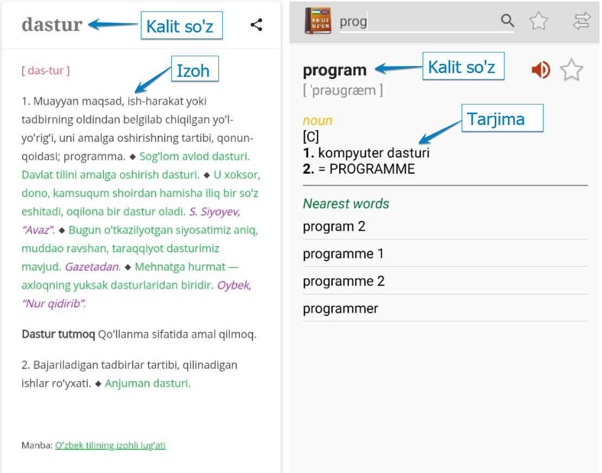
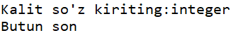
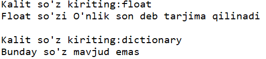

# #14 LUG'AT BILAN TANISHUV

<Embed url="https://youtu.be/s2SsA2_64o4" />

Ushbu darsda yangi ma'lumot turi, Lug'at (Dictionary) bilan tanishamiz. Dars davomida lug'at yaratish, unga ma'lumot qo'shish, lug'atning ichida ro'yxat yoki aksincha ro'yxatning ichida lug'at saqlash ka'bi mavuzlar bilan tanishamiz.

Lug'at, ma'lumotlarni bizga tushunarliroq ko'rinishda saqlash imkonini beradi. Misol uchun biz biror avtomobilga oid lug'at yaratishimiz va lug'atda shu avtoga tegishli barcha ma'lumotlarni saqlashmiz mumkin (nomi, rangi, yili, motori, narhi va hokazo).

## LUG'AT (DICTIONARY) NIMA?

Keling, nima uchun bu ma'lumot turi lug'at (dictionary) deyilishini tushunish uchun, oddiy lu'gatga qaraymiz. Odatda, lug'atdagi ma'umotlar ikki qismdan iborat bo'ladi: kalit so'z va izoh (yoki tarjima).



Xuddi oddiy lug'atlardagi ka'bi Python lug'atidagi ma'lumotlar ham ikki qismdan iborat bo'ladi: kalit so'z va qiymat (ingliz tilida *key-value pair* yoki *kalit so'z-qiymat juftligi* deyiladi).

:::info
Dasturlashda ko'p ishlatiladigan atamalarni ingliz tilida yodlab qolish juda muhim! Bu sizga kelajakda yangi ma'lumotlar izlashda, xatolar usitda ishlashda va umuman ish faoliyatingizda ko'p asqotadi. Shuing uchun variable, integer, float, string, list, tuple, dictionary, function, loop, va boshqa so'zlarni yaxshilab o'zlashtirib oling.
:::

Keling, sodda lug'at yaratamiz:

```python
car_0 = {'model':'ferrari','rang':'qizil'}
```

Yuqorida `car_0` degan lug'at yaratdik. Lu'gatda 2 ta ma'lumot bor: mashinaning modeli (ferrari) va rangi (qizil). Bu yerda `'model'` va `'rang'` kalit so'zlar, `'ferrari'` va `'qizil'` esa mos keluvchi kalit so'zlarning qiymatlari. Kalit so'z va qiymat orasi ikki nuqta (`:`) bilan, lug'atdagi har bir juftlik esa vergul (`,`) bilan ajratilgan.

## LUG'AT BILAN ISHLASH

Demak, Pytonda lug'at *kalit so'z-qiymat* juftliklarining yi'ginidisi ekan. Lug'atdagi biror qiymatni ko'rish uchun unga kalit so'z orqali murojat qilamiz:

```python
car_0 = {'model':'ferrari','rang':'qizil'}
print(car_0['model'])
```

Natija: `ferrari`

```python
print(car_0['rang'])
```

Natija: `qizil`

Lug'atdagi qiymatlar son (`int`, `float`), matn (`string`), ro'yxat (`list`, `tuple`) va hatto boshqa lug'at ham bo'lishi mumkin.

```python
talaba_0 = {'ism':'murod olimov','yosh':20,'t_yil':2000}
print(f"{talaba_0['ism'].title()},\
 {talaba_0['t_yil']}-yilda tu'gilgan,\
 {talaba_0['yosh']} yoshda")
```

Natija: `Murod Olimov, 2000-yilda tu'gilgan, 20 yoshda`

### YANGI JUFTLIK QO'SHISH

Lug'aga yangi kalit so'z va qiymatlar qo'shishimiz ham mumkin. Keling, yuqoridagi `talaba_0` nomli lu'gatga yana 2 ta yangi, kurs va fakultet nomli, kalit so'zlar va qiymatlar qo'shamiz:

```python
talaba_0['kurs'] = 4 # yangi, 'kurs' nomli kalit so'zga 4 qiymatini yuklaymiz
talaba_0['fakultet'] = 'informatika' # 'fakultet' ga esa 'informatika' 
```

Lug'atni konsolga chiqarib ko'ramiz:

```python
print(talaba_0)
```

Natija: `{'ism': 'abdulloh', 'yosh': 20, 't_yil': 2000, 'kurs': 4, 'fakultet': 'informatika'}`

### BO'SH LUG'AT

Ba'zida dastur boshida bo'sh lug'at yaratib, dastur davomida lug'atga yangi ma'lumotlar kiritib borish talab qilinishi mumkin. Bundah holatda bo'sh lug'at quyidagicha yaratiladi:

```python
talaba_1 = {}
```

Dastur davomida esa lug'atga qiymatlar kiritib borilishi mumkin:

```python
talaba_1['ism'] = 'qobil rasulov'
talaba_1['kurs'] = 3
talaba_1['yosh'] = 20
print(talaba_1)
print(f"Talaba {talaba_1['ism'].title()} {talaba_1['kurs']}-kurs")
```

Natija:

`{'ism': 'qobil rasulov', 'kurs': 3, 'yosh': 20}`

`Talaba Qobil Rasulov 3-kurs`

:::info
Lug'atga kalit so'zlar qanday ketma-ketlikda kiritilsa, shu ketma-ketlik saqlanib qoladi.
:::

### QIYMATNI O'ZGARTIRISH

Biror kalit so'zga tegishli qiymatni o'zgartirish esa quyidgachia amalga oshiriladi:

```python
talaba_1['kurs'] = 4 # 'kurs' ni 4 ga o'zgartiramiz.
print(f"Talaba {talaba_1['ism'].title()} {talaba_1['kurs']}-kurs")
```

Natija: `Talaba Qobil Rasulov 4-kurs`

### KALIT SO'Z-QIYMAT JUFTLIGINI O'CHIRISH

Lu'gatdagi biror juftlik kerak emas bo'lsa uni del operatori yordamida lug'atdan olib tashlashimiz mumkin:

```python
talaba_0 = {'ism':'murod olimov','yosh':20,'t_yil':2000}
print(talaba_0)
del talaba_0['yosh'] # yosh degan kalit so'z (va qiymatni) o'chiramiz
print(talaba_0)
```

Natija:

`{'ism': 'murod olimov', 'yosh': 20, 't_yil': 2000}`

`{'ism': 'murod olimov', 't_yil': 2000}`

### LUG'ATNI QATORLARGA BO'LIB YOZISH

Uzung lug'atlarni bir necha qatorga bo'lib yozishimiz ham mumkin. Keling quyidagi misolni ko'ramiz, siz do'stlaringizdan ular qanday telefon ishlatishini so'radingiz va javoblarni bitta lug'atga joylamoqchisiz:

```python
telefonlar = {
    'ali':'iphone x',
    'vali':'galaxy s9',
    'olim':'mi 10 pro',
    'orif':'nokia 3310'
    }
```

Demak, lug'atni qatorga bo'lib yozish uchun katta qavs ochamiz, yangi qatordan joy tashlab, birinchi klit so'z va qiymatni kiritamiz, qator oxirida vergul qo'yib, yangi qatordan keyingi juftlikni yozamiz va hokazo. Oxirgi juftlikdan so'ng vergul qo'ymasdan qator tashlab, katta qavsni yopamiz.

:::info
Lug'atlarning ishlatilish doirasi juda keng va sizning yondoshuvingizga bog'liq xolos. Yuqoridagi lug'atga ham e'tibor qilsangiz, biz bir narsa (shaxs, avto) haqida ko'p ma'lumotlarni emas,  ko'pchilik haqida bir hil ma'lumotlarni saqladik.
:::

### `get()` METODI

Biz shu vaqtgacha lug'atdagi qiymatlarni ko'rish uchun to'g'ridan-to'g'ri kalit so'z orqali murojat qilayotgan edik. Bu usulning kamchiligi shundaki, agar lug'atda siz so'ragan kalit topilmasa, dastur **KeyError** xatoligi bilan to'xtab qoladi.

```python
phone = telefonlar['ali']
print(f"Alining telefoni {phone}")
```

Natija: `Alining telefoni iphone x`

```python
phone = telefonlar['hasan']
print(f"Hasanning telefoni {phone}")
```

Natija: **`KeyError: 'hasan'`**

Lug'atda `'hasan'` kalit so'zi bo'lmagani uchun, yuqoridagi kod **KeyError** degan xatoni qaytardi. KeyError ham [Run time error](https://python.sariq.dev/lirik-chekinish-1/12-xatolar#run-time-error-dasturni-bajarishda-xatolik) qatoriga kiradi.

Biz kelgusi darslarimizda Pythondagi xatolarni dastur bajarilishi jarayonida "tutib olishni" o'rganamiz. Hozircha esa `get()` metodi yordamida lug'atga murojat qilish va mavjud bolmagan kalitning o'rniga biror xabar qaytarishni ko'raylik.

```python
phone = telefonlar.get('hasan','Bunday ism mavjud emas')
```

Yuqorida, lug'at nomidan so'ng .get() metodini yozdik, va argumentlar sifatida kalit so'z (`'hasan'`) va kalit mavjud bo'lmaganda chiqadigan xabarni yozdik (`'Bunday ism mavjud emas'`).

```python
print(phone)
```

Natija: `Bunday ism mavjud emas`

:::info
Agar `.get()` metodida ikkinchi argumentni tashlab ketsangiz, va kalit mavjud bo'lmasa `.get()` metodi `None` degan qiymatni qaytaradi. `None` - qiymat mavjud emas degan ma'noni beradi.
:::

```python
phone = telefonlar.get('hasan')
print(phone)
```

Natija: `None`

## AMALIYOT

* otam (onam, akam, ukam, va hokazo) degan lug'at yarating va lug'atga shu inson haqida kamida 3 ta m'alumot kiriting (ismi, tu'gilgan yili, shahri, manzili va hokazo). Lug'atdagi ma'lumotni matn shaklida konsolga chiqaring :`Otamning ismi Mavlutdin, 1954-yilda, Samarqand viloyatida tug'ilgan`
* Oila a'zolaringizning sevimli taomlari lug'atini tuzing. Lug'atda kamida 5 ta ism-taom jufltigi bo'lsin. Kamida uch kishining sevimli taomini konsolga chiqaring: `Alining sevimli taomi osh`
* Python izohli lu'gati tuzing: Lug'atga shu kunga qadar o'rgangan 10 ta so'z (atamani) kiriting (masalan integer, float, string, if, else va hokazo) va har birining qisqacha tarjimasini yozing.
* Foydalanuvchidan biror so'z kiritishni so'rang va so'zning tarjimasini yuqoridagi lug'atdan chiqarib bering. Agar so'z lu'gatda mavjud bo'lmasa, "Bunda so'z mavjud emas" degan xabarni chiqaring.



* Yuqoridagi vazifani `if-else` yordamida qiling va natijani ham foydalanuvchiga tushunarli ko'rinishda chiqaring.



## JAVOBLAR

Javoblar bizning [GitHub](https://github.com/anvarnarz/python-darslar) sahifamizda hamda quyidagi [Repl.it](https://repl.it/@anvarbek/javoblar-14-dars#main.py) portalida mavjud.

<Embed url="https://github.com/anvarnarz/python-darslar" />

<Embed url="https://repl.it/@anvarbek/javoblar-14-dars#main.py" />