# #15 LUG'AT ELEMENTLARI BILAN ISHLASH

<Embed url="https://youtu.be/ArIW3EAtNF4" />

Avvalgi darsimizda lug'at bilan tanishdik, va lug'atdagi elementlarga kalit so'z bo'yicha murojat qilishni o'rgandik. Lug'atlar katta yoki kichik bo'lishi mumkin. Ba'zida lug'atdagi barcha kalitlarni yoki qiymatlarni bilmasligimiz mumkin. Bunday holatda qanday yo'l tutamiz?

Ushbu darsimizda lug'at elementlarini turli usullar yordamida chiqarishni o'rganamiz.

## `.items()` METODI

Ushbu metod yordamida lug'at ichidagi barcha kalit-qiymat juftliklarini ko'rishimiz mumkin.

```python
talaba_0 = {
    'ism':'alijon',
    'familiya':'shamshiyev',
    'yosh':22,
    'fakultet':'matematika',
    'kurs':4
    }

print(talaba_0.items())
```

Natija: `dict_items([('ism', 'alijon'), ('familiya', 'shamshiyev'), ('yosh', 22), ('fakultet', 'matematika'), ('kurs', 4)])`

Bu metodni to'g'ridan-to'g'ri emas, for tsikli yordamida chaqirish orqali lug'atdagi barcha elementlarni tushunarliroq shaklda ko'rishimiz mumkin.

```python
for kalit, qiymat in talaba_0.items():
    print(f"Kalit: {kalit}")
    print(f"Qiymat: {qiymat} \n")
```

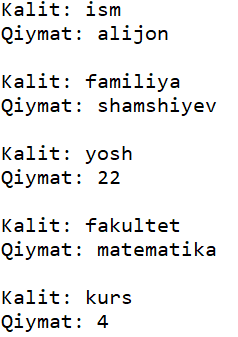

Yuoqirdagi kodda, `talaba_0` lug'atidagi har bir kalit va qiymat juftligini konslga chiqardik. E'tibor bering, `for` tsiklida biz bir emas ikkita o'zgaruvchi yaratib oldik (`kalit` va `qiymat`).

Bu usul ba'zi lug'atlardagi ma'lumotlarni chiroyli ko'rinishda chiqarish uchun juda qo'l keladi.

```python
telefonlar = {
    'ali':'iphone x',
    'vali':'galaxy s9',
    'olim':'mi 10 pro',
    'orif':'nokia 3310'
    }

for k, q in telefonlar.items():
    print(f"{k.title()}ning telefoni {q}")
```

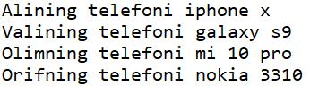

## `.keys()` METODI

Agar lug'atdagi kalit so'zlarni ko'rish talab qilinsa, .keys() metodidan foydalanishimiz mumkin.

```python
mahsulotlar = { # Do'kondagi mahsulotlar
    'olma':10000,
    'anor':20000,
    'uzum':40000,
    'anjir':25000,
    'shaftoli':30000
    }

print(mahsulotlar.keys())
```

Natija: `dict_keys(['olma', 'anor', 'uzum', 'anjir', 'shaftoli'])`

```python
print('Do\'kondagi mahsulotlar:')
for mahsulot in mahsulotlar.keys():
    print(mahsulot.title())
```

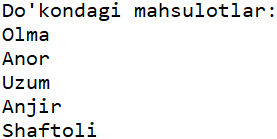

:::info
Yuqoridagi kodimizda, `for` tsiklida `.keys()` metodini ishlatmasak ham huddi shu natija chiqadi.
:::

`for` tsikli va `if` sharti yordamida lug'atdagi biror qiymatlarni alohida chiqarishimiz ham mumkin:

```python
bozorlik = ['anor','uzum','non','baliq']
for mahsulot in mahsulotlar:
    if mahsulot in bozorlik:
        print(f"{mahsulot.title()} {mahsulotlar[mahsulot]} so'm")
```

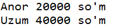

Yuqordagi kodga e'tibor bering. Biz avval `borolik` degan ro'yxat yaratdik (uyga bozor qilyapmiz), keyin esa `mahsulotlar` lug'atidagi har bir mahsulotni bizdagi `bozorlik` ro'yxati bilan solishtirdik. Agar mahsulot bizning `bozorlik` ro'yxatimizda bo'lsa, uning narhini konsolga chiqardik.

Quyidagi misolda esa aksincha, bozorlik ro'yxatidagi har bir elementni do'kondagi mahsulotlar bilan solishtiramiz, va mahsulot do'konda yo'q bo'lsa, do'konga murojat qoldiramiz:

```python
for buyum in bozorlik:
    if buyum not in mahsulotlar:
        print(f"Iltimos, do'koningizga {buyum} ham olib keling")
```

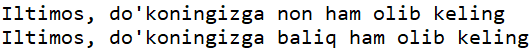

### LUG'AT ELEMENTLARINI TARTIB BILAN CHIQARISH

Pythonda lug'at elementlari siz (foydalanuvchi) kiritgan tartibda saqlanadi. Agar lug'at elementlarini alifbo bo'yicha chiqarish talab qilinsa, sorted() funktsiyasidan foydalanamiz.

```python
print("Do'konimizdagi mahsulotlar:")    
for mahsulot in sorted(mahsulotlar):
    print(mahsulot.title())
```

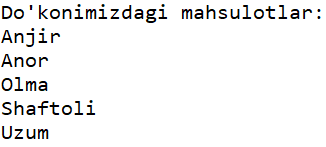

## `.values()` METODI

Agar lug'atdagi qiymatlarni chiqarish talab qilinsa .values() metodidan foydalanishimiz mumkin.

```python
print(telefonlar.values())
```

Natija: `dict_values(['iphone x', 'galaxy s9', 'mi 10 pro', 'nokia 3310']`

```python
print('Foydalanuvchilar quyidagi telefonlarni ishlatishadi:')
for tel in telefonlar.values():
    print(tel)
```

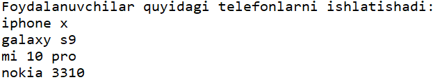

Yuqoridagi usul bilan qiymatlarni chiqrganimizda, lug'atdagi barcha qiymatlar chiqib keladi. Agar, biror qiymat ko'p marta qaytarilsa, konsolga ham ko'p marta chiqib keladi.

Quyidagi misloni ko'raylik:

```python
telefonlar = {
    'ali':'iphone x',
    'vali':'galaxy s9',
    'olim':'mi 10 pro',
    'orif':'nokia 3310',
    'hamida':'galaxy s9',
    'maryam':'huawei p30',
    'tohir':'iphone x',
    'umar':'iphone x'    
    }

print('Foydalanuvchilar quyidagi telefonlarni ishlatishadi:')
for tel in telefonlar.values():
    print(tel)
```

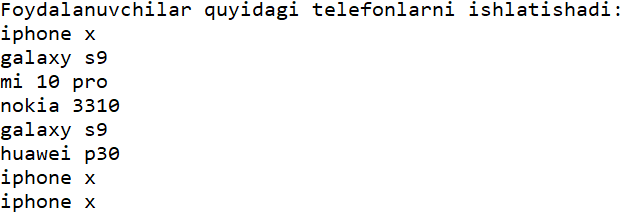

Yuoqirdagi natijaga e'tibor bersanigz, bir nechta foydalanuvchilar **iphone x** va **galaxy s9** telefonidan foydalanishar ekan, va bu modellar qayta-qayta konsolga chiqdi.

Buning oldini olish uchun `set()` funktsiyasidan foydalanishimiz mumkin.

```python
print('Foydalanuvchilar quyidagi telefonlarni ishlatishadi:')
for tel in set(telefonlar.values()):
    print(tel)
```

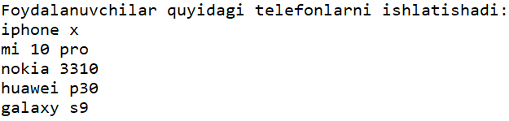

:::info
Pythonda `set` yana bir ma'lumot turi bo'lib, ro'yxat va lug'at kabi bir nechta elementlarni saqlashga mo'ljallangan. Lug'at va ro'yxatdan farqli ravishda, set ichidagi elementlar biror tartibda saqlanmaydi, va ularga indeks orqali murojat qilib bo'lmaydi. Shuningdek, set ichida bir hil elementlar bo'lmaydi.
:::

## AMALIYOT

- Python izohli lug'atini yarating va lug'atga kamida 10 ta so'z qo'shing. Lug'atdagi har bir kalit va qiymatni for tsikli yordamida, alifbo ketma-ketligida chiroyli qilib konsolga chiqaring.

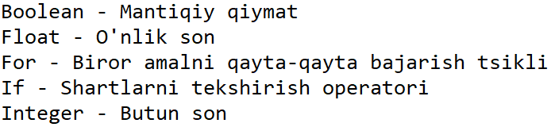

- Davlatlar va ularning poytaxtlari lug'atini tuzing. Avval lug'atdagi davlatlarni, keyin poytaxtlarni alohida-alohida, alifbo ketma-ketligida konsolga chiqaring.

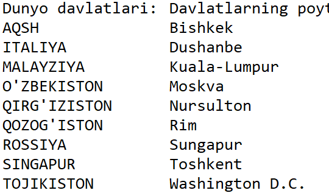

- Foydalanuvchidan istalgan davlatni kiritishni so'rang va shu davlatning poytaxtini konsolga chiqaring. Agar foydalanuvchi lug'atda yo'q davlatni kiritsa, "Bizda bunday ma'lumot yo'q" degan xabarni chiqaring.

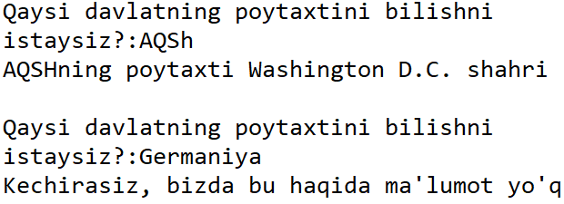

- Restoran menusi lug'atini tuzing (kamida 10 ta taom-narh juftligini kiriting). Foydalanuvchidan 3 ta ovqat buyurtma berishni so'rang. Foydalanuvchi kiritgan taomlarni menu bilan solishtiring, agar taom menuda bo'lsa narhini ko'rsating, aks holda "bizda bunday taom yo'q" degan xabarni chiqaring.

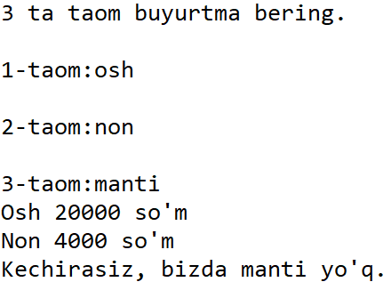

## JAVOBLAR

JAvoblarni [GitHub repositoryda](https://github.com/anvarnarz/python-darslar) yoki Repl.it sahifamizda ko'rishingiz mumkin.

### GitHub

<Embed url="https://github.com/anvarnarz/python-darslar" />

### Repl.it

<Embed url="https://repl.it/@anvarbek/javoblar-15-dars-01#main.py" />

<Embed url="https://repl.it/@anvarbek/javoblar-15-dars-02-03#main.py" />

<Embed url="https://repl.it/@anvarbek/javoblar-15-dars-04#main.py" />
