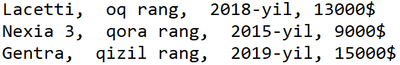
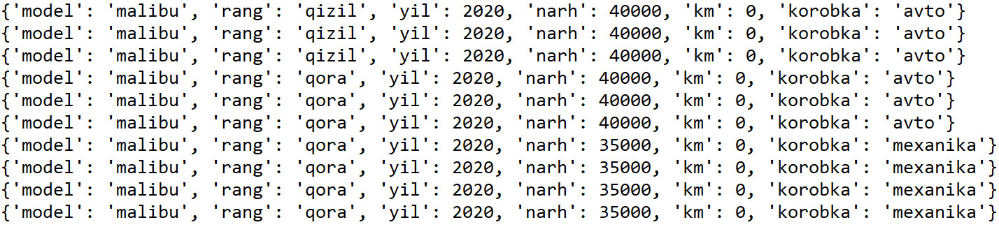
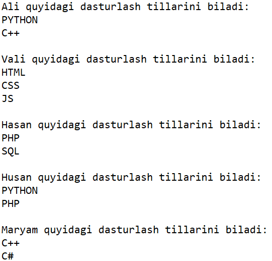
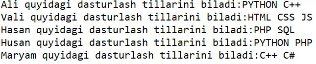
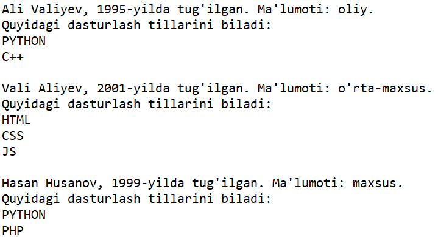
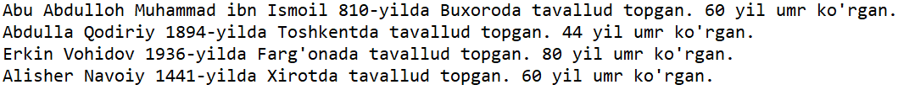
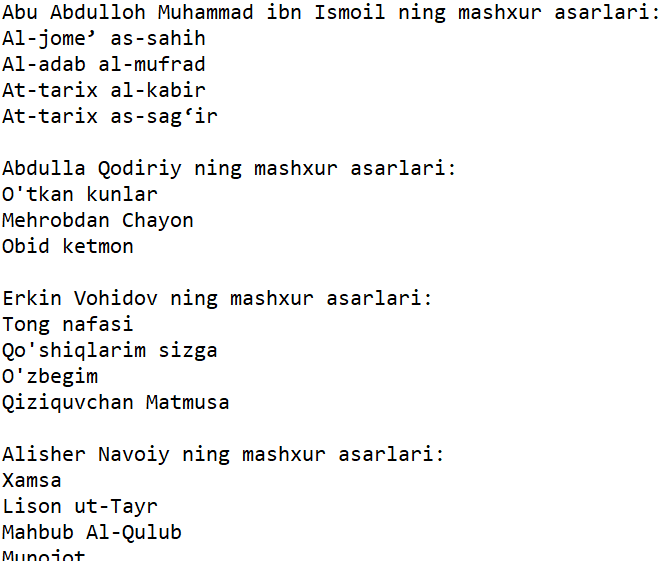
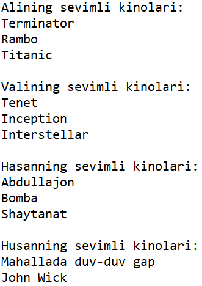
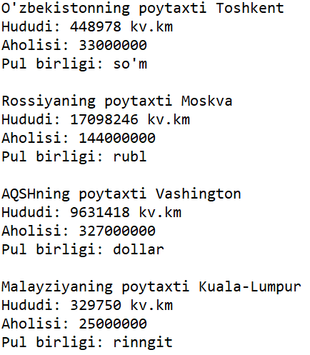
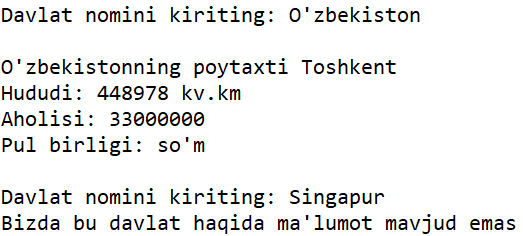

# #16 NESTING

<Embed url="https://youtu.be/IJPmoc-RIO4" />

## NESTING

Ba'zida dasturlash jarayonida lug'atning ichida ro'yxatlar yoki boshqa lug'atni, yoki aksincha ro'yxat ichida lug'atni saqlash ham qo'l kelishi mumkin. Bu ingliz tilida **Nesting** deyiladi. Nesting Pythondagi foydali xususiyatlardan biri.

Keling, bunga bir nechta misollar ko'ramiz.

## LUG'ATLAR RO'YXATI

Biz avvalgi darsimizda talabalarning ma'lumotlarini lug'at shaklida saqlashni ko'rgan edik. Shunday talabalardan yuzlab bo'lganda, ularning har biriga alohida lug'at qilishimiz tabiiy, lekin bu lug'atlar bilan ishlash qiyinchilik tug'dirishi mumkin. Shunday xolatda barcha lug'atlarni (talabalarni) bitta ro'yxatga joylab, ular ustida turli amallar bajarish mumkin.

Kelin quyidagi misolni ko'ramiz, bazamizda bir nechta mashinalar bor. Har bir mashina alohida lug'at shaklida.

```python
car0 = {
        'model':'lacetti',
        'rang':'oq',
        'yil':2018,
        'narh':13000,
        'km':50000,
        'korobka':'avtomat'
        }

car1 = {
        'model':'nexia 3',
        'rang':'qora',
        'yil':2015,
        'narh':9000,
        'km':89000,
        'korobka':'mexanika'
        }

car2 = {
        'model':'gentra',
        'rang':'qizil',
        'yil':2019,
        'narh':15000,
        'km':20000,
        'korobka':'mexanika'
        }
```

Agar biz har bir lug'atga alohida murojat qiladigan bo'lsak, lug'atlarning nomlarini yodlab qolishimiz talab qilinar edi:

```python
car = car0
print(f"{car['model'].title()},\
  {car['rang']} rang,\
  {car['yil']}-yil, {car['narh']}$")

car = car1
print(f"{car['model'].title()},\
  {car['rang']} rang,\
  {car['yil']}-yil, {car['narh']}$")

car = car2
print(f"{car['model'].title()},\
  {car['rang']} rang,\
  {car['yil']}-yil, {car['narh']}$")  
```


Keling, barcha avtolarni bitta ro'yxatga joylaymiz, va for tsikli yordamida birma-bir konsolga chiqaramiz:

```python
cars = [car0, car1, car2]
for car in cars:
    print(f"{car['model'].title()}, "
          f"{car['rang']} rang, "
          f"{car['yil']}-yil, {car['narh']}$")
```



E'tibor bering, ishimiz bir muncha yengillashdi, kodimiz ham qisqardi. Natija esa bir hil.

Endi biz ro'yxat ichidagi istalgan lug'atga indeks bo'yicha murojat qilaveramiz (lug'at nomini yodlab qolish shart emas).

```python
print(cars[0])
```

Natija: `{'model': 'lacetti', 'rang': 'oq', 'yil': 2018, 'narh': 13000, 'km': 50000, 'korobka': 'avtomat'}`

Biror lug'atdagi elementga murojat qilish uchun esa quyidagi usuldan foydalanishimiz mumkin:

```python
print(cars[0]['model'])
```

Natija: `lacetti`

```python
print(f"{cars[2]['rang'].title()} "
      f"{cars[2]['model']}")
```

Natija: `Qizil gentra`

`for` tsikli yordamida biz bo'sh lug'atlar ro'yxatini ham yaratib olishimiz mumkin:

```python
malibus=[] # Malibu mashinalari uchun bo'sh ro'yxat yaratdik
for n in range(10):
    new_car = { # har bir yangi mashina uchun lug'at yaratamiz
        'model':'malibu',
        'rang':None, # rangi noaniq
        'yil':2020,
        'narh':None, # narhi belgilanmagan
        'km':0,
        'korobka':'avto'
        }
    malibus.append(new_car) # yangi lug'atni ro'yxatga qo'shamiz
```

Yuqoridagi misloda biz 10 ta Malibu mashinasidan iborat ro'yxat tuzdik. E'tibor qiling, `'rang'` kalitiga qiymat bermadik va `None` deb qoldirdik. Endi ishlab chiqarish jarayonida mashinalarga turli ranglarni berishimiz mumkin.  Misol uchun birinchi 3 ta mashinaga qizil rang beramiz:

```python
for malibu in malibus[:3]:
    malibu['rang']='qizil'
```

Keyingi 3 tasiga esa qora:

```python
for malibu in malibus[3:6]:
    malibu['rang']='qora'
```

Oxirgi 4 ta avtoni qora, lekin korobkasini mexanika qilamiz:

```python
for malibu in malibus[6:]: # ohirgi 4 ta mashinani
    malibu['rang']='qora'  # rangi qora
    malibu['korobka']='mexanika' # korobkasi mexanika
```

Keling endi, mashinalarning korobkasidan chiqqan holda narh belgilaymiz:

```python
for malibu in malibus:
    if malibu['korobka']=='avto':
        malibu['narh']=40000
    else:
        malibu['narh']=35000
```



## LUG'AT ICHIDA RO'YXAT

Bir kalitga bir nechta qiymatlar berish talab qilinganda, qiymatlarni ro'yxat ko'rinishida yozish o'rinlidir. Misol uchun, bir tashkilotda bir nechta dasturchilar ishlaydi va har bir dasturchi turli dasturlash tillarini biladi. Keling dasturchilar lug'atini tuzamiz va har bir dasturchi haqidagi ma'umotni konsolga chiqaramiz:

```python
dasturchilar = {
    'ali':['python','c++'],
    'vali':['html','css','js'],
    'hasan':['php','sql'],
    'husan':['python','php'],
    'maryam':['c++','c#']
    }

for ism, tillar in dasturchilar.items():
    print(f"\n{ism.title()} quyidagi dasturlash tillarini biladi:")
    for til in tillar:
        print(til.upper())
```



:::info
Pythondagi `print()` funktsiyasi har bir matndan so'ng yangi qator tashlaydi. Buning oldini olish uchun quyidagi usuldan foydalanish mumkin: `print(string, end = '')`
:::

```python
for ism, tillar in dasturchilar.items():
    print(f"\n{ism.title()} quyidagi dasturlash tillarini biladi:", end='')
    for til in tillar:
        print(f'{til.upper()} ', end='')
```



## LUG'AT ICHIDA LUG'AT

Bunday qilish tavsiya etilmasada, istisno holatlarda lug'at ichidagi qiymatlarni lug'at ko'rinishida ham saqlash mumkin. Misol uchun, ish joyingizdagi hamkasblaringiz haqidagi ma'lumotlarni saqlashda, hamkasbingizning ismi kalit, u haqidagi ma'lumotlarni esa lug'at ko'rinishida berilishi mumkin.

```python
hamkasblar = {
    'ali':{'familiya':'valiyev',
           'tyil':1995,
           'malumot':'oliy',
           'tillar':['python','c++']
           },
    'vali':{'familiya':'aliyev',
            'tyil':2001,
            'malumot':"o'rta-maxsus",
            'tillar':['html', 'css', 'js']},
    'hasan':{'familiya':'husanov',
             'tyil':1999,
             'malumot':'maxsus',
             'tillar':['python','php']}
    }
```

Hamkasblar to'g'risidagi ma'lumotlarni esa quyidagicha ko'rish mumkin:

```python
for ism, info in hamkasblar.items():
    print(f"\n{ism.title()} {info['familiya'].title()}, "
          f"{info['tyil']}-yilda tug'ilgan. "
          f"Ma'lumoti: {info['malumot']}. \n"
          "Quyidagi dasturlash tillarini biladi:")
    for til in info['tillar']:
        print(til.upper())
```



:::info
Lug'at ichidagi lug'atlar bir hil tuzilishga ega bo'lgani ishingizni ancha yengillashtiradi, aks holda kodingiz murakkablashib ketishi mumkin.
:::

## AMALIYOT

* Adabiyot (ilm-fan, san'at, internet) olamidagi 4 ta mashxur shaxlar haqidagi ma'lumotlarni lug'at ko'rinishida saqlang. Lug'atlarni bitta ro'yxatga joylang, va har bir shaxs haqidagi ma'lumotni konsolga chiqaring.



* Yuqoridagi lug'atlarga har bir shaxsning mashxur asarlari ro'yxatini ham qo'shing. For tsikli yordamida muallifning ismi va uning asarlarini konsolga chiqaring.



* Oila a'zolaringiz (do'stlaringiz) dan 3 ta sevimli kino-seriali haqida so'rang. Do'stingiz ismi kalit, uning sevimli kinolarini esa ro'yxat ko'rinishida lug'artga saqlang.  Natijani konsolga chiqaring.



* Davlatlar degan lug'at yarating, lug'at ichida bir nechta davlatlar haqida ma'lumotlarni lug'at ko'rinishida saqlang. Har bir davlat haqida ma'lumotni konsolga chiqaring.



* Yuqoridagi dasturga o'zgartirish kiriting: konsolga barcha davlatlarni emas, foydalanuvchi so'ragan davlat haqida ma'lumot bering. Agar davlat sizning lug'atingizda mavjud bo'lmasa, "*Bizda bu davlat haqida ma'lumot yo'q*" degan xabarni chiqaring.



## JAVOBLAR

### GitHub

<Embed url="https://github.com/anvarnarz/python-darslar" />

### Repl.it

<Embed url="https://repl.it/@anvarbek/javoblar-16-dars-01#main.py" />

<Embed url="https://repl.it/@anvarbek/javoblar-16-dars-02#main.py" />

<Embed url="https://repl.it/@anvarbek/javoblar-16-dars-03#main.py" />

<Embed url="https://repl.it/@anvarbek/javoblar-16-dars-04#main.py" />

<Embed url="https://repl.it/@anvarbek/javoblar-16-dars-05#main.py" />