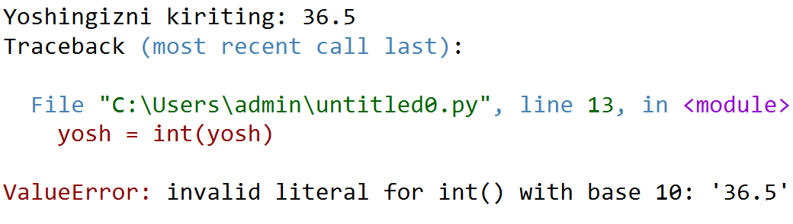
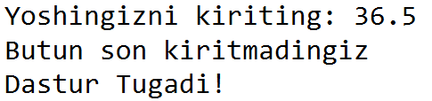
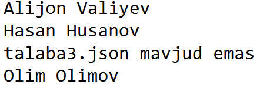
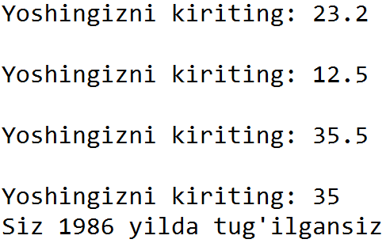

# #35 XATOLAR BILAN ISHLASH

<Embed url="https://youtu.be/xgXGCaMX_sY" />

## EXCEPTIONS

Avvalgi darslarimizning birida biz "**Run time error"** xatoliklari bilan tanishgan edik. Bunday xatolar dastur bajarish jarayonida kelib chiqadi va dasturning ishlashini to'xtatadi. Sintaks xatolikdan farqli ravishda Python bunday xatolarni dasturni bajarishdan avval aniqlay olmaydi.

Ushbu darsimizda qanday qilib mana shunday xatoliklarni jilovlashni o'rganamiz. Maqsadimiz xatolik yuz berganda dastur to'xtab qolishining oldini olish. Gap shundaki, dastur davomida xato yuz berganda Python maxsus *exception* (istisno) obyektini yaratadi. Agar bu obyekt "tutib" olinmasa, dastur bajarilishdan to'xtaydi.

## `try-except`

Istisno obyektlarni tutib olish uchun Pythonda maxsus `try-except` operatorlari bor. Bu operatorlar quyidagicha ishlaydi, `try` operatori badanida bajarish kerak bo'lgan kod yoziladi, `except` operatori badanida esa xatolik yuz berganda bajarilishi kerak bo'lgan kod yoziladi. Ya'ni dasturimiz to'xtab qolmasdan bajarilaveradi.

Tushunarli bo'lishi uchun quyidagi misolni ko'ramiz.

```python
yosh = input("Yoshingizni kiriting: ")
yosh = int(yosh)
print(f"Siz {2021-yosh} yilda tug'ilgansiz")
```

Yuqoridagi misolning 1-qatorida biz foydalanuvchidan yoshini kiritishni so'rayabmiz. Navbatdagi qatorda esa foydalanuvchi kiritgan qiymatni int() yordamida butun songa o'tkazayapmiz. Agar foydalanuvchi yoshini kiritganda, butun emas, o'nlik son kiritsa bu `ValueError` xatoligiga olib keladi, va dastur bajarilishdan to'xtaydi.



Keling, yuqoridagi kodni `try-except` yordamida yozamiz:

```python
yosh = input("Yoshingizni kiriting: ")
try:
    yosh = int(yosh)  
    print(f"Siz {2021-yosh} yilda tug'ilgansiz")  
except:
    print("Butun son kiritmadingiz")

print("Dastur Tugadi!")
```

Bu yerda ham dastavval foydalanuvchi yoshini so'radik. `int()` finksiyasini esa `try` badani ichida yozdik, agar foydalanuvchi to'gri qiymat kiritgan bo'lsa kodimiz foydalanuvchi tug'ilgan yilini hisoblab ko'rsatadi, exception (istisno) yuz berganda esa `"Butun son kiritmadingiz"` xabarini konsolga chiqaradi. Lekin dastur bajarilishdan to'xtamaydi, va try-except blokidan keyingi qatorlar ham bajarilaveradi (`print("Dastur Tugadi!")`). Buni quyidagi natijadan ham ko'rishimiz mumkin:



`try-except` operatorining afzalliklaridan biri, foydalanuvchiga tushunarsiz xatolar o'rniga, o'zimiz istagan, tushunarliroq matnni ko'rsatishimiz mumkin. Shuningdek, kompleks tizimlarda arzimagan xatoni deb dasturimiz to'xtab qolmaydi.

## `try-except-else`

Yuqoridagi kodimizda biz try moduli ichida xato qaytarishi mumkin bo'lgan ifodani ham (`tyil = int(tyil)`), xato qaytmaganda bajarilishi kerak bo'lgan ifodani ham (`print(f"Siz {2021-tyil} yoshdasiz")` ) birdan yozib ketayapmiz. Aslida, bunday qilishimiz to'g'ri emas.

To'g'ri usuli, bu avval xatoga tekshirish va xato yuz bermaganda bajariladigan ifodani alohida, `else` blokida yozish:

```python
yosh = input("Yoshingizni kiriting: ")
try:
    yosh = int(yosh)    
except:
    print("Butun son kiritmadingiz")
else:
    print(f"Siz {2021-yosh} yilda tug'ilgansiz")
```

Albatta, yuqoridagi usul har doim ham qo'l kelavermaydi.

## MA'LUM TURDAGI XATOLARNI USHLASH

Xatolarning turlari ko'p, `except` operatori yordamida esa biz aynan qaysi xatolarni ushlamoqchi ekanimizni ham ko'rsatishimiz mumkin. Misol uchun yuqoridagi misolda `int()` funksiyasi `ValueError` xatosini qaytardi. Agar biz faqatgina shu turdagi xatolarni ushlamoqchi bo'lsak, kodimizni quyidagicha o'zgartiramiz:

```python
yosh = input("Yoshingizni kiriting: ")
try:
    yosh = int(yosh)    
except ValueError:
    print("Butun son kiritmadingiz")
else:
    print(f"Siz {2021-yosh} yilda tug'ilgansiz")
```

### `ZeroDivisionError`

Ba'zi dastur davomida arifmetik amallar bajarilishi natijasida 0 ga bo'lish xatoligi (`ZeroDivisionError`) yuzaga kelishi mumkin. Aynan shu xatoni jilovlash uchun, `except ZeroDivisionError` ifodasidan foydalanamiz:

```python
x,y=5,10
try:
   y/(x-5)
except ZeroDivisionError:
    print("0 ga bo'lib bo'lmaydi")
```

Natija: `0 ga bo'lib bo'lmaydi`

### **`IndexError`**

Bu xatolik odatda ro'yxatda mavjud bo'lmagan indeksga murojat qilishda chiqib keladi.

```python
mevalar = ['olma','anor','anjir','uzum']
try:
    print(mevalar[7])
except IndexError:
    print(f"Ro'yxatda {len(mevalar)} ta meva bor xolos")
```

Natija: `Ro'yxatda 4 ta meva bor xolos`

### `KeyError`

Bu xatolik lug'atda mavjud bo'lmagan kalitga murojat qilishda kelib chiqadi:

```python
user = {"username":"sariqdev",
        "status":"admin",
        "email":"admin@sariq.dev",
        "phone":"99897123456"}

key="tel"
try:
    print(f'Foydalanuvchi: {user[key]}')
except KeyError:
    print("Bunday kalit mavjud emas")
```

Natija: `Bunday kalit mavjud emas`

### `FileNotFoundError`

Avvalgi darsimizda fayllar bilan ishlashni o'rgangan edik. Fayllarni biz o'qish (`open(filename,'r')`) yoki yozish (`open(filename,'w')`) uchun ochishimiz mumkin. Agar faylga ma'lumot yozish uchun ochishda, mavjud bo'lmagan faylga murojat qilsak, Python yangi fayl yaratadi. Lekin, faylni o'qish uchun ochishda fayl nomini xato yozsak, yoki mavjud bo'lmagan faylni ochmoqchi bo'lsak `FileNotFoundError` (fayl topilmadi) xatoligi yuzaga keladi.

```python
filename = "data.txt" # bunday fayl mavjud emas
with open(filename) as f:
    text = f.read()
```

Natija: `FileNotFoundError: [Errno 2] No such file or directory: 'data.txt'`

Demak, bu xatolikni ham ushlab qolish uchun `except FileNotFoundError` ifodasidan foydalanamiz:

```python
filename = "data.txt" # bunday fayl mavjud emas
try:
    with open(filename) as f:
        text = f.read()
except FileNotFoundError:
    print(f"Kechirasiz, {filename} fayli mavjud emas. Bosh fayl tanlang.")
```

Natija: `Kechirasiz, data.txt fayli mavjud emas. Bosh fayl tanlang.`

Pythonda bundan boshqa xatolar ham ko'p uchraydi, ularning ba'zilari [12-darsda tanishgan edik](https://python.sariq.dev/lirik-chekinish-1/12-xatolar#run-time-error-dasturni-bajarishda-xatolik).

### BIR NECHTA XATOLARNI USHLASH

`try-except` ketma-ketligida bir nechta `except` operatorlari ham bo'lishi mumkin. Ularning har biri ma'lum turdagi xatolik uchun javobgar bo'ladi:

```python
n = input("Butun son kiriting: ")
try:
    n = int(n)
    x=20/n
except ValueError: # agar foydalanuvchi butun son kiritmasa
    print("Butun son kiritmadingiz")
except ZeroDivisionError: # agar foydalanuvchi 0 kiritsa
    print("0 ga bo'lib bo'lmaydi")
else:
print(f"x={x}")
```

## XATOLARNI KO'RSATMAY O'TISH

Yuqoridagi misollarda kodimiz xato qaytarganda, dasturimiz foydalanuvchiga qandaydur ma'lumotni ko'rsatayapti:

```python
import json
files = ['talaba1.json','talaba2.json','talaba3.json','talaba4.json']
for filename in files:
    try:
        with open(filename) as f:
            talaba = json.load(f)        
    except FileNotFoundError:
        print(f"{filename} mavjud emas")
    else:
        print(talaba['ism'])
        # fayl ustida turli amallar 
```



Hech qanday ma'lumot ko'rsatmay, dasturni davom etish uchun `pass` operatoridan foydalanamiz. Odatda `pass` operatoridan funksiyalar yoki operatorlarning badanini "to'ldirib" ketish uchun ishlatiladi. Ya'ni, agar biz `except` operatorini yozsagu, uning badanida hech narsa bajarilishini istmasak, `pass` operatorini ishlatamiz.

```python
import json
files = ['talaba1.json','talaba2.json','talaba3.json','talaba4.json']
for filename in files:
    try:
        with open(filename) as f:
            talaba = json.load(f)        
    except FileNotFoundError:
        pass
    else:
        print(talaba['ism'])
```

## XATOLARNING OLDINI OLISH

Yuqorida biz xatolar yuz berganda, ularni ushlash va dastur to'xtashining oldini olishni ko'rdik. Ya'ni, `try-except` ketma-ketligi xatolarning oldini olishga yordam bera olmaydi. Xatolarning oldini olish uchun `if-else` va `while` tsikllaridan foydalanganimiz afzal.

Mavu boshidagi misolimizga qaytsak. Biz foydalanuvchi yoshini so'radik, va foydalanuvchi butun son kiritmagani sababli dasturni to'xtatdik. Aslida, while tsikli yordamida toki foydalanuvchi to'g'ri qiymat kritgunga qadar uning yoshini qayta-qayta talab qilishimiz mumkin:

```python
while True:
    yosh = input("Yoshingizni kiriting: ")
    if yosh.isdigit():
        yosh = int(yosh)
        break        

print(f"Siz {2021-yosh} yilda tug'ilgansiz")
```



Albatta yuqordagi usul barcha xatolar uchun ishlamaydi. Shunday xatolar bo'lishi mumkinki, biz ularni oldindan ko'ra olmasligimiz yoki, oldindan to'g'rila olmasligimiz, yoki xato foydalanuvchiga bog'liq bo'lmasligi mumkin. Shunday holatlarda, `try-except` operatorlari bizning xaloskorimiz bo'ladi.

## KODLAR

<Embed url="https://github.com/anvarnarz/python-darslar" />