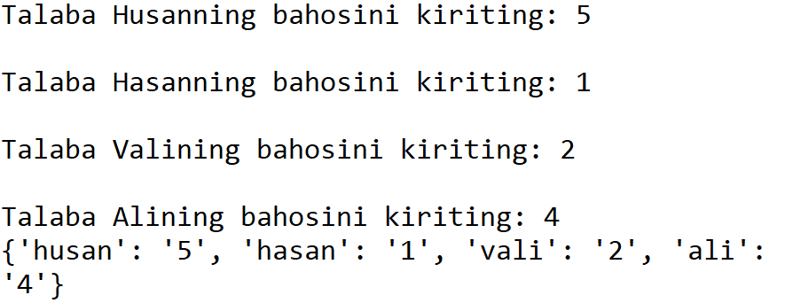
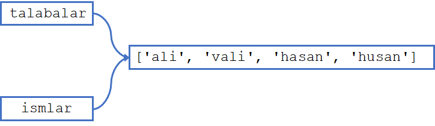

# #21 FUNKSIYA VA RO'YXAT

<Embed url="https://www.youtube.com/watch?v=vNeZD2LTI94" />

## FUNKSIYAGA RO'YXAT UZATISH

Biz avvalgi darslarimizda funksiyaga parametr sifatida yagona qiymat berayotgan edik. Aslida, bu bilan cheklanmasdan, funksiyaga ro'yxat (list) ham berishimiz mumkin. Bunda, funksiya ro'yxat qiymatlariga to'g'ridan-to'g'ri murojat qila oladi.

Keling talabalarni baholaydigan funksiya yozamiz. Funksiyamiz talabalar ro'yxatini qabul qilib oladi, ro'yxatdan har bir talabani sug'urib olib (`.pop()`), bahosini kiritishni so'raydi. Talaba ismi va bahosini lug'atga joylab, yakuniy lug'atni foydalanuvchiga qaytaradi.

```python
def bahola(ismlar):
    baholar = {}
    while ismlar:
        ism = ismlar.pop()
        baho = input(f"Talaba {ism.title()}ning bahosini kiriting: ")
        baholar[ism]=baho
    return baholar

talabalar = ['ali', 'vali', 'hasan', 'husan']
baholar = bahola(talabalar)
print(baholar)
```



## RO'YXATGA O'ZGARTIRISH KIRITISH

Funksiyaga ro'yxat uzatganimizda, funksiya ro'yxat elementlariga to'g'ridan-to'g'ri murojat qila oladi. Ro'yxatga funksiya ichida kiritilgan o'zgartirishlar asl ro'yxatga ham ta'sir qiladi. Avvalgi misolimizga qaytaylik:

```python
talabalar = ['ali', 'vali', 'hasan', 'husan']
baholar = bahola(talabalar)
print(talabalar)
```

Natija: `[]`

Yuqoridagi funksiya unga uzatilgan ro'yxat ichidagi talabalarning ismini `.pop()` yordamida sug'urib olgani uchun bizning asl ro'yxatimiz ham bo'shab qoldi. E'tibor bering, funksiya tashqarisidagi va ichidagi ro'yxatlar ikki hil nomlangan bo'lsada (`talabalar` va `ismlar`), ikkalasi ham xotiradagi bitta ro'yxatga bog'langani sabab ulardan biriga o'zgartirish kiritilishi bilan, ikkinchisi ham o'zgaradi.



## ASL RO'YXATGA O'ZGARTIRISH KIRITISHNING OLDINI OLISH

Agar funksiya asl ro'yxatga o'zgartirish kiritishini istamasangiz, funksiyaga ro'yxatning o'zini emas, uning nusxasini uzatish mumkin. Buning uchun funksiya parametrini `royxat_nomi[:]` ko'rinishida yozish kifoya. Bunda `[:]` operatori ro'yxatdan nusxa olishni bildiradi:

```python
talabalar = ['ali', 'vali', 'hasan', 'husan']
baholar = bahola(talabalar[:])
print(talabalar)
```

Natija: `['ali', 'vali', 'hasan', 'husan']`

## AMALIYOT

- Matnlardan iborat ro'yxat qabul qilib, ro'yxatdagi har bir matnning birinchi harfini katta harfga o'zgatiruvchi funksiya yozing.

```python
ismlar = ['ali', 'vali', 'hasan', 'husan']
katta_harf(ismlar)
print(ismlar)
```

Kutilgan natija: `['Ali', 'Vali', 'Hasan', 'Husan']`

- Yuoqirdagi funksiyani asl ro'yxatni o'zgartirmaydigan va yangi ro'yxat qaytaradigan qilib o'zgartiring

```python
ismlar = ['ali', 'vali', 'hasan', 'husan']
yangi_ismlar = katta_harf(ismlar)
print(ismlar)
print(yangi_ismlar)
```

Kutilgan natija:

`['ali', 'vali', 'hasan', 'husan']`

`['Ali', 'Vali', 'Hasan', 'Husan']`

- Darsimiz davomida yozgan bahola funksiyasini `.pop()` metodidan foydalanmasdan va asl ro'yxatga o'zgartirish kiritmasdan faqat lug'at qaytaradigan qilib yozing.

## JAVOBLAR

### GitHub

<Embed url="https://github.com/anvarnarz/python-darslar" />

### Repl.it

<Embed url="https://repl.it/@anvarbek/javoblar-21-01#main.py" />

<Embed url="https://repl.it/@anvarbek/javoblar-21-02#main.py" />

<Embed url="https://repl.it/@anvarbek/javoblar-21-03#main.py" />
