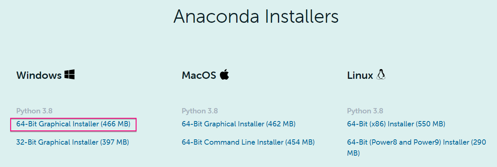
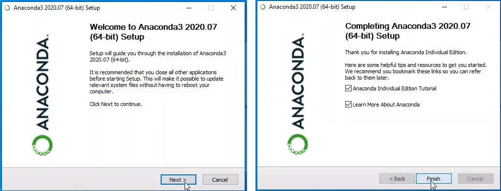
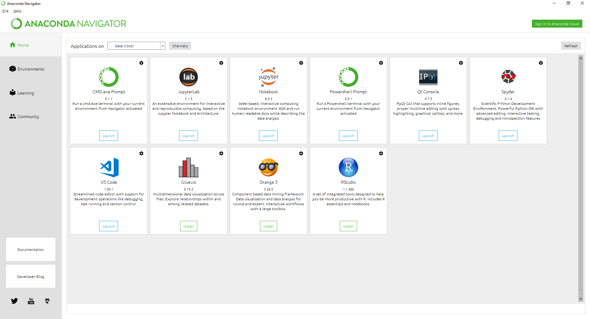
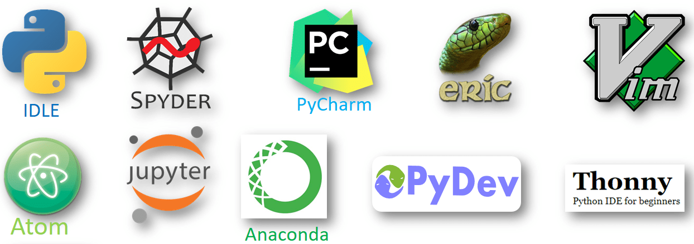
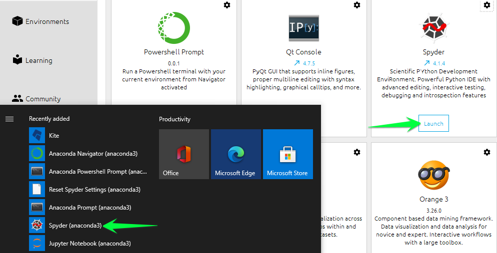
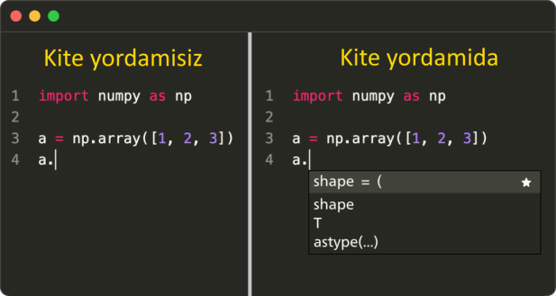
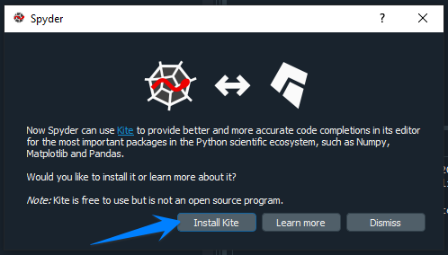
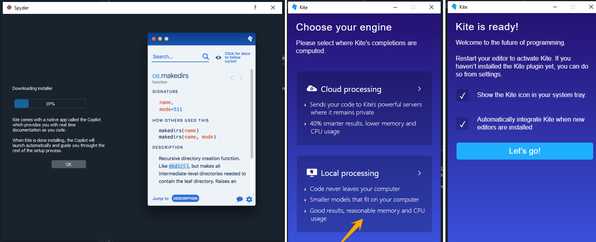
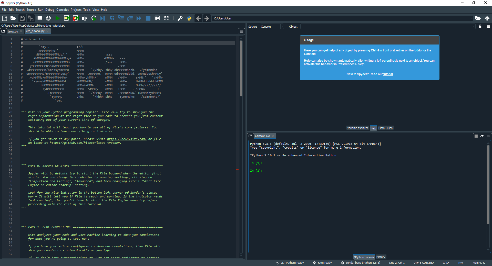

# #01 KERAKLI DASTURLAR

## PYTHON

Kod yozish uchun avvalo kompyuterimizda Python o'rnatilgan bo'lishi kerak. Biz buning uchun Pythonni to'g'ridan-to'g'ri o'rnatib emas, balki [Anaconda ](https://www.anaconda.com)platformasini o'rnatish orqali amalga oshiramiz.

Bunday qilishimizning bir nechta sabablari bor:

- Anaconda Python nisbatan tezroq
- Anaconda biz uchun kerakli bo'lgan qo'shimcha dasturlar va muhim paketlar bilan birga o'rnatiladi
- Anacondada turli dasturlar (loyihalar) uchun alohida muhit yaratish mumkin

### Repl.it

Agar siz turli sabablarga ko'ra kompyuteringizga Python o'rnata olmasangiz, [repl.it ](https://repl.it/)sahifasi yordamida Python dasturlarini to'g'ridan-to'g'ri brauzerda ham yozishingiz mumkin.

<Embed url="https://www.youtube.com/watch?v=fTaLQKNuOXU" />

:::tip
Biz darsimiz davomida yozilgan kodlarni va mashg'ulotlarning javoblarini Repl.it sahifasiga yuklab boramiz.
:::

## ANACONDA

Anaconda platformasini o'rnatamiz.

<Embed url="https://www.youtube.com/watch?v=xforSDte5-4" />

- [ ] Kompyuterimizda brauzerni ochib, [https://www.anaconda.com/products/individual](https://www.anaconda.com/products/individual) sahifasiga kiramiz va **Download** tugmasini bosamiz.
- [ ] Kompyuterimizda o'rnatilgan operatsion tizim uchun mos keluvchi faylni yuklab olamiz (_agar yuqoridagi jumlani tushunmagan bo'lsangiz, katta ehtimollik bilan sizda 64-Bit Windows operatsion tizimi o'rnatilgan_)

- [ ] Yuklab olingan faylni ochamiz, va o'rnatamiz _(hech qanday o'zgartirishlarga hojat yo'q, NEXT, ACCEPT, FINISH tugmalarini bosib turamiz xolos)_

- [ ] Anaconda o'rnatilganidan so'ng Windowsdagi dasturlar orasida Anaconda Navigator dasturini ochamiz.

## **SPYDER IDE**

**Spyder** — Python tilida kod yozich uchun mo'ljallangan dasturlash muhiti va bizning asosiy ish qurolimizdir. Ingliz tilida dasturlash muhiti - **IDE** (Integrated Development Environment) deyiladi.

Dastur yozish uchun yuzlab turli muhitlar bor. Aslida, umuman muhitsiz, oddiy matn redaktorida ham kod yozishimiz mumkin edi. Lekin Spyder va unga o'xshash muhitlar dasturchilarning ishini yengillatishga qaratilgan. Muhitlar turli qo'shimcha funktsiyalar va foydali xossalarga boy bo'ladi.

Kelajakda siz o'zingiz uchun qulay muhitni tanlab, yangi dasturlarni yangi muhitda yozishingiz mumkin. Boshlanishiga esa biz Anaconda bilan birga keladigan qulay va sodda, lekin shu bilan birga funktsiyalarga boy bo'lgan Spyder muhitini tanlaymiz.

Spyder dasturini Android Navigator yoki Windows orqali to'g'ridan-to'g'ri ochish mumkin.

## **KITE**

Spyder dastruni ilk marotaba ochganimizda [**Kite** ](https://www.kite.com/)dasturlash yordamchisini (pogramming assistant) o'rnatishni taklif qilishi mumkin.

**Kite** —sun'iy intellekt asosida ishlovchi virtual yordamchi bo'lib, kod yozishni osonlashtiradi. Kite yordamida istalgan funktsiya yoki komanda haqida qo'shimcha ma'lumot olishingiz mumkin. Shungdek Kite sizga kodlarni to'g'ri yozishda ishora (подсказка) ham ko'rsatib turadi.

Maslahatim, 5 minut vaqtingizni qizg'anmay, Kite yordamchisini ham o'rnating\*\*:\*\*

**Va nihoyat Spyder IDE ochiladi:**

**Yuqoridagi qadamlarni muvaffqaiyatli yakunlagan bo'lsangiz, siz birinchi dasturingizni yozishga tayyorsiz!**

## **AMALIYOT**

Kompyuteringizga Anaconda platformasini o'rnating.
