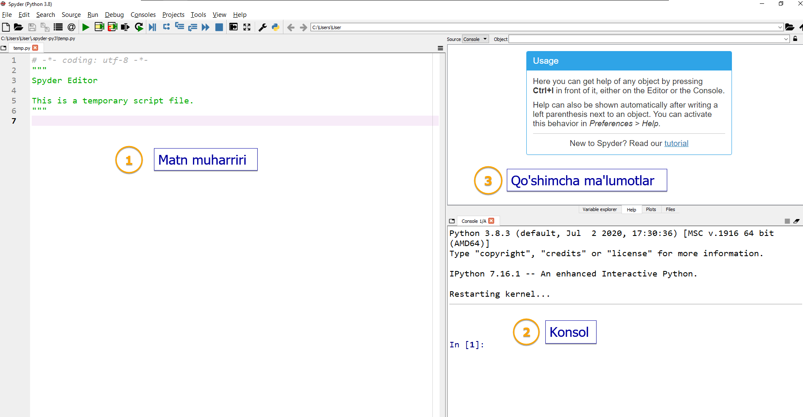
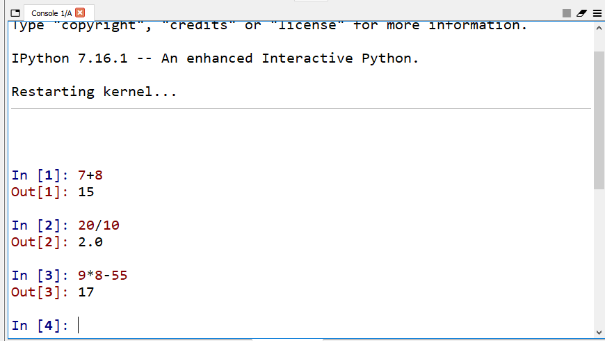
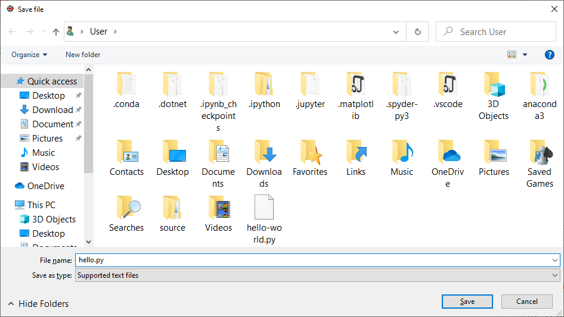
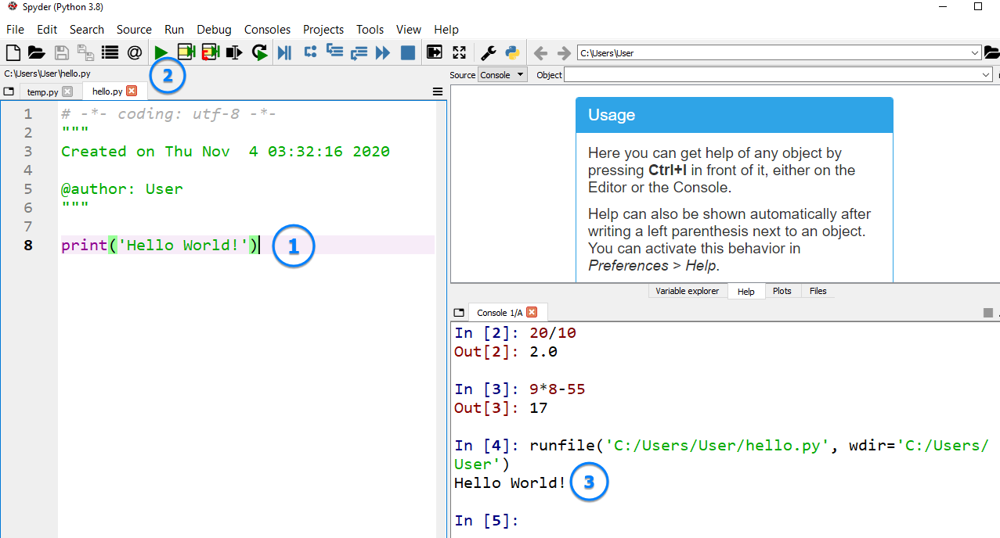

# #02 HELLO WORLD!

<Embed url="https://youtu.be/dguiNk8eHPY" />

:::info
Mavzuning aksar qismi video darsimizda yoritilgan bo'lsada, quyidagi matnlarga ham ko'z yugurtirib chiqish foydadan xoli bo'lmaydi.
:::

## SPYDER IDE BILAN TANISHAMIZ

Spyder muhiti uch qismdan iborat:

1. **Matn muharriri** —dasturlar yozish uchun.
1. **Konsol** —qisqa kodlarni bajarib, tekshirib ko'rish uchun.
1. **Qo'shimcha ma'lumotlar** oynasi. Bu yerda quyidagi ma'lumotlarni ko'rish mumkin:
   1. Turli funktsiyalar haqida yordam
   1. Dasturdagi o'zgaruvchilar ro'yhati
   1. Grafiklar
   1. Fayllar



Konsolda qisqa kodlarni bajarib, natijasini ko'rish mumkin. Misol uchun oddiy arifmetik amallarni bajarib ko'raylik:



## BIRINCHI DASTURIMIZ —"Hello World!"

Keling an'anaga ko'ra barcha dasturchilar birinchi yozadigan dastur, "Hello World!" dasturini yozamiz.

Buning uchun Spyder IDE yuqorisidagi menuda **File --> New File** bo'limini tanlaymiz (yoki klaviaturada Ctrl+N tugmalarini bosamiz). Math muhrarrirda yangi, **untitled0.py** fayli yaratildi.

Faylga ma'nili nom beramiz, buning uchun **File --> Save as..** menusini tanlaymiz (yoki Ctrl+Shift+S) va yangi ochilgan oynada faylga ma'nili nom beramiz.

:::danger
Faylni nomlashda quyidagi qoidalarga amal qiling:

- Fayl nomi _qisqa, kichkina  lotin harflari bilan_ va eng muhimi _bo'shliq (пробел) qo'ymasdan_ yozilgan bo'lishi kerak
- Fayl nomi **.py** bilan tugashi kerak (misol uchun `faylnomi.py`)
- Faylga ikki so'zdan iborat nom qo'ymoqchi bo'lsangiz so'zlar orasini tire (-) yoki pastki chiziq (\_) bilan ajrating. Misol uchun: `hello-world.py` yoki `hello_world.py`
- Fayl nomini sonlar bilan boshlamang
:::

Yuqoridagi qoidalarga amal qilgan holda faylga `hello.py` deb nom beramiz (siz istlagnahca nomalshingiz mumkin) va **Save** tugmasini bosamiz.



Matn muharririda quyidagi kodni yozamiz:

```python
print("Hello World!")
```

**print()** bu Pythondagi mahsus funktsiya bo'lib, () ichida berilgan matn yoki ifodalarni ekranga (konsolga) chiqarish vazifasini bajaradi.

:::info
Dars davomida berilgan kodlarni albatta o'zingiz ham bajaring. **Bu juda muhim!**
:::

Kodimizni bajarish uchun **Run** (**►**) tugmasini (yoki F5) bosamiz (yangi ochilgan oynada ham **Run** tugmasini bosamiz) va konsolda natijani ko'ramiz:



Konsolda `Hello World!` yozuvini ko'rgan bo'lsangiz, **TABRIKLAYMIZ!** Siz Pythonda birinchi dasturingizni yozdingiz.


## AMALIYOT

Spyder konsolida va matn muharririda quyidagi kodlarni yozib, bajarib ko'ring. Siz kutgan natijalar chiqdimi?

```python
print('Assalom alaykum')
```

```python
print(Hayrli tong!)
```

```python
print(2+4*2)
```

```python
print(19/5)
```

```python
print(2**4)
```
