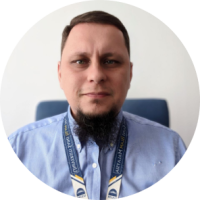
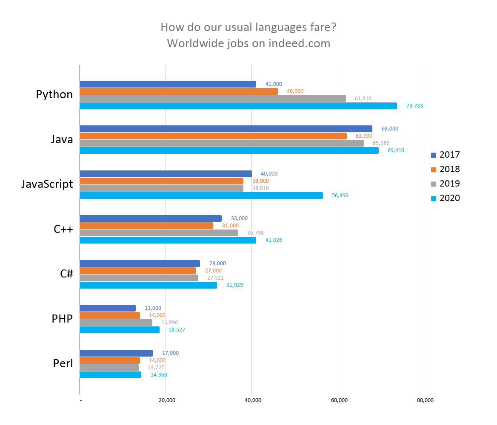
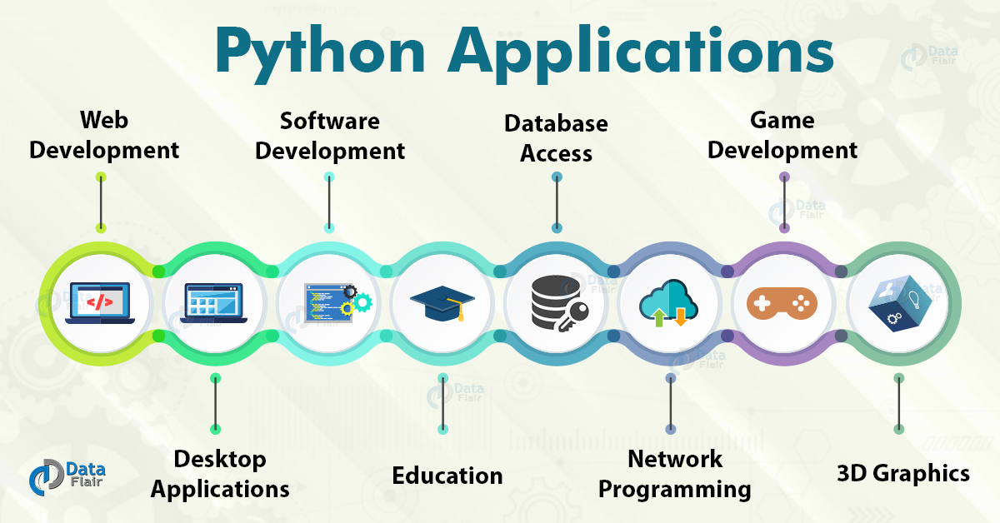

# 💻 DASTURLASH ASOSLARI

<Embed url="https://youtu.be/ZqFjXM8k-PY" />

## MAQSADIMIZ

Darsimizning asl maqsadi tinglovchilarga dasturlash asoslarini va eng muhimi turli muammolarga yechim bo'luvchi dasturlar yozishni o'rgatish.

Buning uchun biz Python tilidan foydalansakda, dars davomida olingan bilimlar barcha dasturlar tili uchun umumiydir.

Darslarni boshlashdan avval, keling...

## TANISHAMIZ

<div align="center">
  
</div>

Ismim **Anvar Narzullaev.**

[Universiti Sains Islam Malaysia](https://www.usim.edu.my) oliygohining Axborot Texnologiyalari kafedrasida yetakchi mutaxassis lavozimida ishlayman. Raqamli Texnologiyalar, Kompyuter Arxitekturasi, Axborot Xavfsizligi fanlaridan dars beraman.

2004 yilda Toshkent Axborot Texnologiyalar Universitetini Telekommunikatsiya yo'nalishini bitirganman.

2006 yilda Janubiy Koreyaning Yeungnam Universitetida Axborot Texnologiyalari Muhandisi yo'nalishida Magistrlik, 2012 yilda esa shu oliygohda Doktorlik (PhD) unvonini himoya qilganman.

2013 yildan beri Malayziyaning turli oliy o'quv yurtlarida Computer Science va Axborot Texnologiyalari yo'nalishlarida dars berib kelaman.

Birinchi professional dasturimni 13 yoshda yozganman. Turli yillar davomida C, C++, Delphi, Matlab, Java va Python tillaridan foydalanib kelganman.

Oxirgi yillarda asosan ikki yo'nalishda ilmiy izlanishlar qilaman: IoT (Internet of things) va AI (Artificial Intelligence).

Asosiy dasturlash qurollarim C++, Matlab va Python.

## ONLAYNDAGI MANZILLARIMIZ

SariqDev telegram kanali: [https://t.me/sariqdev](https://t.me/sariqdev)

SariqDevYoutube kanali: [https://www.youtube.com/sariqdev](https://www.youtube.com/sariqdev)


## DARSLARIMIZ KIM UCHUN?

Darsimizning maqsadi sizni tez va samarali yo'llar bilan Python dasturlash tiliga va eng muhimi dasturchilik olamiga olib kirish. Darsimiz, umrida biror marta Python yoki umuman boshqa tillarda dastur yozmagan barcha yoshdagi insonlarga mo'ljallangan.

**Dars davomida siz barcha tillar uchun umumiy bo'lgan dasturlash asoslarini puxta o'zlashtirib olasiz, bu esa o'z navbatida sizning kelajakdagi faoliyatingiz uchun muhim poydevor bo'ladi.**

Umid qilamizki, darslarimiz boshqa o'qituvchilar va dasturchilar uchun ham foydali manba bo'lib xizmat qiladi.

## DARSLARIMIZ SIZGA NIMA BERADI?

Darslarimiz yakunida siz nafaqat Python tilini, balki barcha dasturlash tillari uchun umumiy bo'lgan tushunchalar va asoslarni ham puxta o'zlashtirib olasiz.

Kursni muvaffaqiyatli tamomlagan tinglovchilar, kelajakda dasturlashning tor va murakkab yo'nalishlarini ham, mutlaqo yangi dasturlash tilini ham yengillik bilan o'zlashtira oladilar.

Darslarimizning **birinchi qismida** siz Python dasturlarini yozish uchun muhim bo'lgan asosiy tushunchalarni o'rganasiz. Ushbu tushunchalar xar qanday dasturlash tillari uchun bir xildir. Jumladan ushbu qism quyidagi mavzularni o'z ichiga oladi:

- Ma'lumotlar turlari va ularni saqlash usullari
- Ma'lumotlar to'plamini yaratish, ular ustida samarali ishlash usullari
- _**While, if**_ tsikllari yordamida shartlarni tekshirish va kodni tarmoqlash
- Interaktiv dasturlar yaratish orqali foydalanuvchilar bilan ikki tomonlama "muloqot" o'rnatish, ulardan ma'lumot qabul qilish
- Kodning ma'lum qismlarini qayta-qayta ishlatish uchun funktsiyalar yozish
- Yozgan dasturingizni tekshirish uchun testlar yozish, va kelajakdagi xatolarning oldini olish

Kursimizning **ikkinchi qismida** esa o'zlashtirgan bilimlaringizni puxtalash uchun bir nechta loyihalar ustida ishlaysiz.

## NIMA UCHUN AYNAN PYTHON?

**Python** — o'rganish uchun oson, foydalanish uchun qulay, ko'p qirrali dasturlash tili bo'lib, dasturlashga yangi kirganlar uchun ham, soha mutaxassislari uchun ham zo'r tanlov.

### Python o'rganish uchun 5 sabab:

- Python dasturlash tiliga bo'lgan talab yildan yilga oshib kelmoqda. CodingDojo portalining tadqiqotlariga ko'ra, 2020 yilda aynan Python tilida dasturlovchi mutaxassislarga eng ko'p talab bo'lgan



- Python Artificial Intelligence (Sun'iy intellekt) va Data Science (Ulkan ma'lumotlar bilan ishlash) sohalarining tili hisoblanadi. Bugungi kunda keng ommalashib borayotgan sun'iy intellekt asosida ishlovchi dasturlarning aksari Pythonda yozilgan. **Bu sohalardagi mutaxassislar bugungi kunda eng noyob va qimmatbaho kadrlar hisoblanadi.**
- Keng qamrovli va universal til. Python dasturlari deyarli barcha operativ tizimlarda va platformalarda ishlaydi.
- O'rganish uchun ham, tushunish uchun ham juda qulay va sodda kod. Quyidagi ikki tilda yozilgan kodlargaga e'tibor bering, va ulardan qay biri tushunarliroq ekanini ko'ring (ikkisi ham bir vazifani bajaradi):

```java
// JAVA
public class Main {
    public static void main(String[] args) {
        System.out.println("Assalom Alaykum!");
    }
}
```

```python
# PYTHON
print("Assalom Alaykum!")
```

- Moslashuvchanlik —Python dasturlash tili ma'lum bir masalalarni yechish bilan chegaralanmagan. Bu til dasturchilarga yangi va yangi yo'nalishlarga ki'rish imkonini beradi. Python quyidagi sohalarda qo'llaniladi: Web va Internet dasturlash, kompyuter o'yinlarini yaratish, ma'lumotlar bazasi bilan ishlash (DB), computer vision, foydalanuvchilar uchun grafik interfeys (GUI), juda tez rivojlanayotgan buyumlar interneti (IoT) texnologiyasi va hokazo.



## **MANBALAR**

Ushbu kursni tayyorlashda quyidagi kitoblar va resurslardan foydalanildi:

1. Eric Matthes, _**Python Crash Course. A Hands-On, Project-Based Introduction to Programming**_, 2nd edition, No Starch Press, 2019
1. [www.learnpython.org](https://www.learnpython.org/)
1. John V. Guttag, _**Introduction to Computation and Programming Using Python, Second EditionWith Application to Understanding Data,**_ MIT Press, 2016
