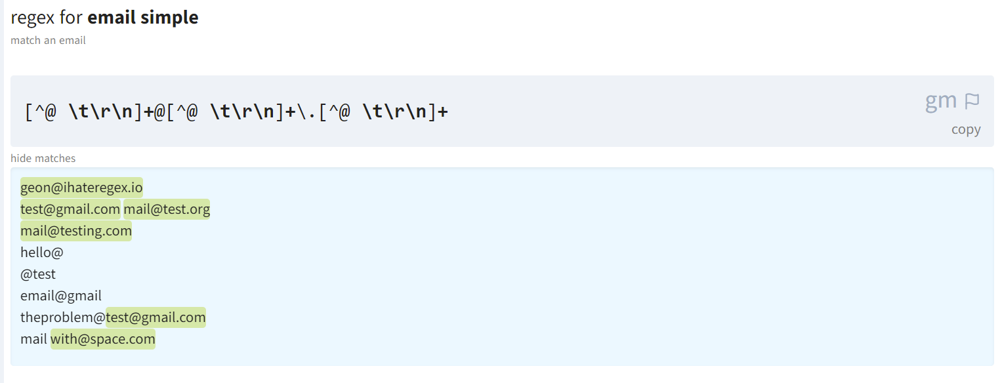

# #38 PYTHON STANDART KUTUBXONASI

<Embed url="https://youtu.be/tvA1QV7D1Lo" />

## KIRISH

Python dasturlash tili yildan-yilga ommalashib bormoqda. Bunga birinchi navbatda Pythonning sodda va tushunarli sintaksi sabab bo'lsa, ikkinchi va ehtimol eng ko'zga ko'ringan sabab bu Pythonning keng qamrovli kutubxonalar to'plamidir. Ushbu darsimizda Pytyon kutubxonasidagi ba'zi muhim modullar bilan tanishamiz. Standart kutubxonanig to'liq tarkibi bilan [Python rasmiy sahifasida](https://docs.python.org/3/library/) tanishishingiz mumkin.

:::tip
Kutubxona bu boshqalar tarafidan yozilgan tayyor funksiyalar va obyektlar to'plami.
:::

## `datetime` — SANA VA VAQT

Ushbu modul yordamida Pythonda sanalar bilan ishlashimiz mumkin. Moduldan foydalanishdan avval uni import qilamiz. Har gal moduldan foydalanishda `datetime` deb qayta yozmaslik uchun, import qilishda modulga `dt` nomini beramiz.

```python
import datetime as dt
```

Hozirgi vaqt va sanani koʻrish uchun `datetime.now()` moduliga murojat qilamiz:

```python
hozir = dt.datetime.now()
print(hozir)
```

Natija: `2021-03-09 12:12:19.894899`

Kurib turganingizdek, natija yil, oy, kun soat, minut, sekund va millisekund koʻrinishida chiqdi. Biz bu qiymatlardan istaganimzni maxsus metodlar yordamida ajratib olishimiz mumkin:

```python
# sanani ajratib olish
print(hozir.date())

# vaqtni ajratib olish
print(hozir.time())

# soatni ajratib olish
print(hozir.hour)

# minutni ajratib olish
print(hozir.minute)

# sekundni ajratib olish
print(hozir.second)
```

Natija:

```aspnet
2021-03-09
12:15:35.367013
12 # soat
15 # minut
35 # sekund
```

Agar bugungi kunning sanasi talab qilinsa `datetime` moduli ichidagi `date.today()` moduliga murojat qilamiz.

```python
bugun = dt.date.today()
print(f"Bugungi sana: {bugun}")
```

Natija: `Bugungi sana: 2021-03-09`

Agar biror sanani qoʻlda kiritish talab qilinsa .date() metodiga kerakli sanani (yil, oy, kun) koʻrinishida kiritamiz.

```python
ertaga = dt.date(2021, 3, 10)
print(f"Ertangi sana: {ertaga}")
```

Natija: `Ertangi sana: 2021-03-10`

Faqatgina vaqt bilan ishlash uchun `.datetime.now().time()` metodiga murojat qilishimiz mumkin:

```python
hozir = dt.datetime.now()
vaqtHozir = hozir.time()
print(f"Hozir soat: {vaqtHozir}")
```

Natija: `Hozir soat: 12:21:54.529788`

Istalgan vaqtni qoʻlda kiritish uchun esa .time() metodiga kerakli vaqtni (soat, minut, sekund) koʻrinishida beramiz:

```python
vaqtKeyin = dt.time(23,45,00)
```

Ayirish operatori yordamida sanalalar va vaqtlar orasidagi farqni hisoblashimiz mumkin:

```python
bugun = dt.date.today()
ramazon = dt.date(2021, 4, 13)
farq = ramazon-bugun
print(farq)
print(f"Ramazonga {farq.days} kun qoldi")
```

Natija: Ramazonga 35 kun qoldi

Huddi shu kabi ikki vaqt oraligʻini sekundlarda yoki soatlarda ham koʻrishimiz mumkin:

```python
hozir = dt.datetime.now()
futbol = dt.datetime(2021, 3, 10, 23, 45, 00)
farq= futbol-hozir
sekundlar = farq.seconds
minutlar = int(sekundlar/60)
soatlar = int(minutlar/60)
print(f"Futbol boshlanishiga {sekundlar} sekund qoldi")
print(f"Futbol boshlanishiga {minutlar} minut qoldi")
print(f"Futbol boshlanishiga {soatlar} soat qoldi")
```

Natija:

```aspnet
Futbol boshlanishiga 40797 sekund qoldi
Futbol boshlanishiga 679 minut qoldi
Futbol boshlanishiga 11 soat qoldi
```

Yuqorida sanalar AQSh standartiga koʻra, yil-oy-kun koʻrinishida chiqayapti. Sanani oʻzimizga moslab chiqarish uchun `.strftime()` metodini chaqiramiz, va sanani oʻzimizga qulay formatda chiqaramiz.

```python
# vaqtni millisekundsiz chiqaramiz
vaqt = hozir.strftime("%H:%M:%S")
print(f"Hozir soat: {vaqt}")

# sanani kun-oy-yil koʻrinishida chiqaramiz
sana = hozir.strftime("%d-%m-%Y")
print(f"Bugun sana: {sana}")

# sanani kun/oy/yil koʻrinishida chiqaramiz
sana_vaqt = hozir.strftime("%d/%m/%Y, %H:%M")
print(sana_vaqt)
```

Natija:

```aspnet
Hozir soat: 12:28:21
Bugun sana: 09-03-2021
09/03/2021, 12:28
```

## `math` —MATEMATIK FUNKSIYALAR

Bu modul oʻz ichida matematikaga oid turli funksilayar va oʻzgaruvchilarni saqlaydi. Keling, ularning baʻzilari bilan tanishamiz.

### $$\pi$$ ning qiymati

```python
import math
PI = math.pi
print(f"PI ning qiymati: {PI}")
```

Natija: `PI ning qiymati: 3.141592653589793`

### e — natural logarifm asosi

```python
E = math.e
print(f"e ning qiymati: {E}")
```

Natija: `e ning qiymati: 2.718281828459045`

### Trigonometriya

Modul tarkibida deyarli barcha trigonometrik funksiyalar mavjud (cos, sin, tangens, arccos, va hokazo)

```python
math.sin(math.pi/2)
math.cos(0)
math.tan(PI)
```

Shunigdek degrees va radians metodlari yordamida burchakdan radianga va aksincha konvertasiya qilishimiz ham mumkin:

```python
math.degrees(math.pi/2)
math.radians(90)
```

### LOGARIFMLAR

`log()` va `log10()` funksiyalari yordamida natural va o'n asosli logarifmlarni hisoblash mumkin:

```python
# natural logarifm
math.log(5)
# 10 asosli logarifm
math.log10(100)
```

### SONLARNI YAXLITLASH

Sonlarni eng yaxlitlash uchun Pythonda maxsus round() funksiyasi mavjud. Bunga qo'shimcha ravishda, math moduli ichidagi ceil() funksiyasi yordamida berilgan o'nlik sonni keyingi butun songa, floor() yordamida esa quyi butun songa yaqinlashtirish mumkin:

```python
x = 4.6
print(math.ceil(x))
print(math.floor(x))
```

Natija:

```aspnet
5
4
```

### ILDIZ VA DARAJA

Berilgan sonning kvadrat ildizini hisoblash uchun sqrt(), sonni darajaga oshirish uchun esa pow() funksiyalariga murojat qilamiz:

```python
x = 81

# Kvadrat ildiz
math.sqrt(x)

# Darajaga oshirish
math.pow(x,3) # x ning kubi
math.pow(x,5) # x ning 5-darajasi
math.pow(x,1/3) # x dan kub ildiz
```

`math` moduli tarkibida boshqa funksiyalar ham mavjud. Yuqorida biz ularning ba'zilari bilan tanishdik. Bu modul asosan butun va oʻnlik sonlar bilan ishlashga moʻljallangan. Kompleks sonlar bilan ishlash uchun `cmath` moduliga murojat qilishingiz mumkin.

## `pprint` - CHIROYLI PRINT

`pprint` moduli yordamida turli o'zgaruvchilarni chiroyli ko'rinishda konsolga chiqarishimiz mumkin. Bu bizga uzun lug'atlar, JSON fayllar yoki matnlar bilan ishlashda juda asqotadi.

Misol uchun, avvalgi darslarimizning birida yaratgan `bemor.json` faylini ochamiz va avval `print()` keyin `pprint()` yordamida konsolga chiqaramiz.

<FileBlock src="https://1283015017-files.gitbook.io/~/files/v0/b/gitbook-legacy-files/o/assets%2F-MGbkqs1tROquIT6oqUs%2F-MVKOuCO1rXy2QNl5hSo%2F-MVLISWmRxClH303Kj8C%2Fbemor.json?alt=media&token=63a76c45-6a4d-44a8-bef0-d09345879f23" />

```python
from pprint import pprint
import json

filename = 'bemor.json'
with open(filename) as f:
    bemor = json.load(f)

print(bemor)
```

Natija:

```aspnet
{'ism': 'Alijon Valiyev', 'yosh': 30, 'oila': True, 'farzandlar': ['Ahmad', 'Bonu'], 'allergiya': None, 'dorilar': [{'nomi': 'Analgin', 'miqdori': 0.5}, {'nomi': 'Panadol', 'miqdori': 1.2}]}
```

Navbat `pprint()` funksiyasiga:

```python
pprint(bemor)
```

Natija:

```aspnet
{'allergiya': None,
 'dorilar': [{'miqdori': 0.5, 'nomi': 'Analgin'},
             {'miqdori': 1.2, 'nomi': 'Panadol'}],
 'farzandlar': ['Ahmad', 'Bonu'],
 'ism': 'Alijon Valiyev',
 'oila': True,
 'yosh': 30}
```

## RegEx - ANDOZA YORDAMIDA MATN IZLASH

Pythondagi juda foydali modullardan biri bu **`re`** (*regular expressions*) moduli. Bu modul yordamida biror matn berilgan andozaga tushish, tushmalsigini tekshrib ko'rishimiz mumkin. Yoki berilgan andoza asosida matnlar orasidan kerakli matnlarni ajratib olish mumkin.

Keling boshlanishiga sodda misol ko'ramiz. Quyida biz 3 ta so'z va so'zlarni tekshirish uchun andoza yaratdik. Quyidagi andozamiz т harfidan boshlanuvchi (`^т`), р harfiga tugovchi (р`$`), 5 harfdan iborat so'zlarni qidiradi (`^т...р$`).

:::tip
Avvaliga andozalarni tushunish biroz qiyin bo'lishi mumkin, lekin vaqt o'tishi bilan andoza qanday ishlashini tushunib olasiz deb umid qilamiz.
:::

So'zlarni andozaga solishtirish uchun `re.match()` funksiyasidan foydalanamiz. Agar tekshirgan so'zimiz andozaga mosh tushsa, `re.match()` metodi so'zni o'zini qaytaradi, aks holda `None` qiymatini qaytaradi.

```python
import re

word1 = "темир"
word2 = "томир"
word3 = "тулпор"

andoza = "^т...р"

print(re.match(andoza, word1))
print(re.match(andoza, word2))
print(re.match(andoza, word3))
```

Natija:

```python
<re.Match object; span=(0, 5), match='темир'>
<re.Match object; span=(0, 5), match='томир'>
None
```

Natijadan ko'rishimiz mumkin, `word1` va `word2` o'zgaruvchilari anfozaga tushdi, `word3` esa tushmadi.

Keling endi, so'z to'pish o'yinida ishlatilgan soz'lar ro'yxatidan foydalanamiz, va ro'yxatdan biz bergan andozaga tushuvchi so'zlarni ajratib olamiz.

```python
from uzwords import words
andoza = "^т...р$"

matches = []
for word in words:
    if re.match(andoza,word):
        matches.append(word)
print(matches)
```

Natija:

```aspnet
['табар', 'табор', 'тавир', 'тайёр', 'татар', 'татир', 'тахир', 'тақир', 'театр', 'тембр', 'темир', 'темур', 'тенор', 'тикер', 'тихир', 'товар', 'товор', 'тожир', 'томир', 'тонер', 'тоҳир', 'триер', 'тумор', 'тўпар', 'тўпир']
```

Andozalar biror matnda biz uchun kerakli maʻlumotlarni ajratib olish uchun juda qulay. Masalan, Telegram orqali yuborilgan habardan email manzilini yoki telefon raqamini ajratib olish uchun maxsus andoza yozishmiz mumkin. [ihateregex.io](https://ihateregex.io/) sahifasidan esa loyihangiz uchun tayyor andozalarni topishingiz mumkin.



Keling, yuqoridagi andoza asosida biror matndan email manzilini ajratib olamiz. Buning uchun `re.findall()` funksiyasidan foydalanamiz.

```python
matn = """Maqolalar  2020-yilning 20-martiga qadar rtmkonferensiya2021@mail.ru elektron pochtasida qabul qilinadi.
Quyidagi yo'nalishdagi maqolalar qabul qilinadi:
👉 Aniq va tabiiy fanlarni zamonaviy pedagogik texnologiyalar asosida o‘qitish  metodikasi.
👉 Umumta’lim  fanlarini o‘qitishda  STEAM yondashuvning o’rni va ahamiyati. """

andoza = '[^@ \t\r\n]+@[^@ \t\r\n]+\.[^@ \t\r\n]+'
email = re.findall(andoza,matn)
print(email)
```

Natija: `['rtmkonferensiya2021@mail.ru']`

Andoza yordamida foydalanuvchi kiritgan qiymatlarni ham ma'lum shartlarga javob berishini tekshirib olishimiz mumkin:

```python
# Kuchli parolni tekshirish
# Quyidagi andoza ham ihateregex.io sahifasidan olindi
andoza = '^(?=.*?[A-Z])(?=.*?[a-z])(?=.*?[0-9])(?=.*?[#?!@$ %^&*-]).{8,}$'
msg = "Yangi parol kiriting"
msg += '(kamida 8 belgidan iborat, kamida 1 ta lotin bosh harf, 1 ta kichik harf, '
msg += '1 ta son va 1 ta maxsus belgi boʻlishi kerak): '

while True:
    password = input(msg)
    if re.match(andoza,password):
        print("Maxfiy so'z qabul qilindi")
        break
    else:
        print("Maxfiy so'z talabga javob bermadi")
```

RegEx juda katta mavzu boʻlgani uchun, kelajakda bu haqida alohida dars qilamiz.

## AMALIYOT

* Bugungi sanadan boshlab 2 hafta farq bilan 10 ta sanani konsolga chiqaring
* Ramazon va qurbon hayitigacha qolgan kunlarni konsolga chiqaring
* Tug'ilgan kuningizdan bugungi sanagacha qancha yil, oy, kun o'tganini qaytaruvchi funksiya yozing
* Foydalanuvchidan telefon raqamini kiritishni so'rang. Kiritlgan qiymatni andoza yordamida tekshiring
* Berilgan matndan veb sahifa manzilini ajratib olyuvchi funksiya yozing. Quyidagi matndan namuna sifatida foydalanishingiz mumkin:

> Assalom alaykum hurmatli do'stlar. Navbatdagi darsimiz YouTubega yuklandi: [https://youtu.be/vsxJPRLXpgI](https://youtu.be/vsxJPRLXpgI)
>
> Ushbu darsimizda unittest moduli yordamida klasslarning xususiyatlar va metodlarini tekshiruvchi dastur yozishni o'rganamiz. Bugungi dars manzili: [https://python.sariq.dev/testing/37-klass-test](https://python.sariq.dev/testing/37-klass-test)

## KODLAR

<Embed url="https://github.com/anvarnarz/python-darslar" />