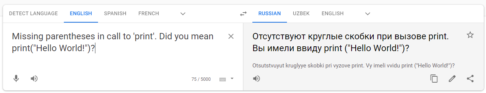
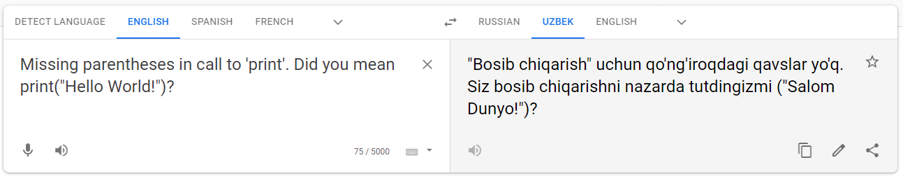
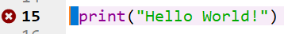
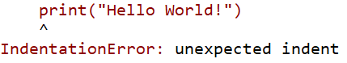
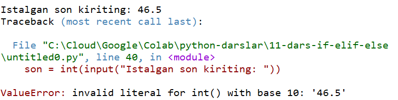
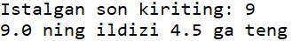
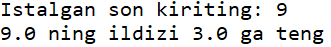
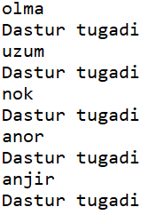

# #12 XATOLAR BILAN ISHLASH

<Embed url="https://www.youtube.com/watch?v=Zp8hhWN_qwQ&feature=youtu.be" />

## XATOLAR

Har qanday dasturchi kod yozishda xato qiladi. Ko'p yozgan odam esa ko'p xato qiladi va bu tabiiy. Ba'zi xatolarimiz Python tomonidan dastur bajarilishdan avvaloq aniqlanadi. Ba'zilari esa dastur bajarish jarayonida aniqlanib, dasturimiz to'xtab qoladi. Keling, bugun dasturlashni yangi boshlaganlar eng ko'p yo'l qo'yadigan xatolar bilan tanishamiz.

## **SyntaxError** - SINTEKS XATOLIK

Biz *syntax error* bilan [3-darsimizda ](https://python.sariq.dev/ilk-qadamlar/03-print)tanishgan edik. Bu eng ko'p uchraydigan xato bo'lib, odatda dasturlash tili qoidalariga amal qilmaslik natijasida kelib chiqadi. Aksar dasturlash muhitlari sintaks xatolikni dastur bajarilishidan avvaloq aniqlab, dasturchiga ishora beradi. Sintaks xatolik bor dasturni Python bajarmaydi.

```python
print "Hello World!"
```

Natija: **`SyntaxError: Missing parentheses in call to 'print'. Did you mean print("Hello World!")?`**

Odatda dasturlash muhiti xatoning turi bilan birga (SyntaxError), xato haqida qo'shimcha ma'lumot ham beradi (`Missing parentheses in call to 'print'. Did you mean print("Hello World!")?`). Agar ingliz tilini tushunmasangiz, [Google Translate](https://translate.google.com/?ui=tob\&sl=en\&tl=ru\&op=translate) sahifasi yordamida matnni rus yoki o'zbek tiliga tarjima qilib olishingiz mumkin.

:::info
Agar rus tilini bilsangiz, xato matnini rus tilga tarjima qiling. O'zbek tilidagi tarjimalar hali biroz tushunarsiz.
:::





### EOL va EOF xatolik

EOL (End of Line - qator yakuni) xatoligi sintaks xatolikning bir turi bo'lib, odatda qator oxirida qo'shtirnoq (birtirnoq) ni yopish esdan chiqqanda yuzaga keladi.

```python
print("Hello World!
```

Natija: **`SyntaxError: EOL while scanning string literal`**

EOF (End of function - funktsiya yakuni) xatoligi esa funktsiya oxirida qavsni yopish esdan chiqqanda yuzaga keladi.

```python
print("Hello World!"
```

Natija: **`SyntaxError: unexpected EOF while parsing`**

EOF xatoligining muammoli tarafi, Python aynan qaysi funktsiya yopilmay qolganini ko'rsata olmaydi, ya'ni kodni sinchiklab ko'zdan kechirib chiqish talab qilinadi.

## IndentationError - JOY TASHLASHDA XATOLIK

Python tilida qator boshidan yoki joy tashlab yozish muhim ahamiyatga ega. Qator boshidan asossiz joy qoldirish IndentationError ga olib keladi.

Quyidagi kodga e'tibor bering, qator boshida 1 dona bo'sh joy qolgani uchunoq Spyder muhiti xatolikni aniqlab, qizil bilan belgilab qo'ydi.





Ba'zi joylarda esa aksincha, bo'sh joy tashlab yozish talab qilinadi. Masalan, `for` tsiklida yoki `if-elif-else` shartlarining ichida va hokazo.

```python
print("O'ngacha sanaymiz")
for n in range(10):
print(n+1)
```

Natija: `IndentationError: expected an indented block`

```python
son = 50
if son>=0:
    print("Musbat son")
else:
print("Manfiy son")
```

Natija: `IndentationError: expected an indented block`

### QANCHA JOY TASHLAYMIZ?

Yuqoridagi misollarda IndentationError oldini olish uchun joy tashlash talab qilindi. Xo'sh, qancha joy tashlash kerak va qanday qilib?

Aslida, hech bo'lmaganda 1 harflik bo'sh joy qoldirish ham bizni IndentationError dan xalos qiladi. LEKIN, biz dastur davomida bir hil joy tashlashga odatlanishimiz kerak.

Qoida sifatida kamida 4 ta harflik joy yoki 1 ta TAB (klaviaturadagi tab tugmasi) joy tashlashni odat qilishimiz kerak. Va eng muhimi ikkalasini aralashtirmasligimiz lozim. Ya'ni agar siz joy tashlash uchun Space (probel) ishlatsangiz, oxirigacha shunday qiling, agar Tab ishlatsangiz oxirigacha tab ishlating. Ikkalasini aralashtirmang!


## RUN TIME ERROR - DASTURNI BAJARISHDA XATOLIK

**Run time error** — dastur bajarish jarayonida kelib chiqadi va dasturning ishlashini to'xtatadi. Sintaks xatolikdan farqli ravishda Python bunday xatolarni dasturni bajarishdan avval aniqlay olmaydi. Run time error ning bir necha turi bor. Keling, ulardan ba'zilari bilan tanishamiz.

### TypeError

Biror amalni (funktsiya, metod) noto'g'ri ma'lumot turi ustida bajarish.

```python
son = input("Istalgan son kiriting: ")
print(f"{son} ning kvadrati {son**2} ga teng")
```

Natija: **`TypeError: unsupported operand type(s) for ** or pow(): 'str' and 'int'`**

Yuqoridagi kodda biz foydalanuvchi kiritgan qiymatni matndan songa o'tkazib olishni unutdik, natijada sonning kavdratini hisoblashda Python xato berdi.

### NameError

O'zgaruvchi, funktsiya, obyekt nomini noto'g'ri yozish natijasida kelib chiquvchi xatolik.

```python
prit("Hello World!")
```

Natija: `NameError: name 'prit' is not defined`

```python
mevalar = ['olma','uzum','nok','anor','anjir']
for meva in mvealar:
    print(meva)
```

Natija: `NameError: name 'mvealar' is not defined`

### ValueError

Funktsiyaga noto'g'ri qiymatni yuborish natijasidagi xatolik

```python
son = int(input("Istalgan son kiriting: "))
if son>=0:
    print("Musbat son")
else:
    print("Manfiy son")
```



Yuqoridagi dasturning 1-qatorida foydalanuvchidan istalgan son kiritishni so'rayabmiz, va foydalanuvchi kiritgan qiymatni `int` ya'ni butun songa o'tkazyabmiz. Kodning o'zida xato yo'q, lekin dastur bajarish jarayonida foydalanuvchi butun son emas, o'nlik son kiritgani uchun ValueError xatosi chiqdi. Sababi int() funktsiyasi faqatgina butun sonlar ko'rinishidagi matn bilan ishlaydi.

Dastur xato bermasligi uchun yoki `int()` funktsiyasini `float()` ga almashtrishimiz kerak, yoki foydalanuvchidan butun son kiritishni talab qilishimiz kerak.

### IndexError

Yangi dasturchilar yo'l qo'yadigan yana bir xato bu indeks xatolik. Ya'ni ro'yxat elementlariga murojat qilishda indeksni noto'g'ri kiritish.

```python
mevalar = ['olma','anor','uzum']
print(mevalar[3])
```

Natija: **`IndexError: list index out of range`**

Bizda mevalar degan ro'yxat bor va ro'yxatda uchta meva bor. Biz 3-elementni konsolga chiqarmoqchimiz va print(mevalar\[3]) deb yozdik va IndexError natijasini oldik. Sababi, dasturlashda indeks 0 dan boshlanadi va 3-elementga murojat qilish uchun 2-indeksni tanlaymiz. Demak, to'g'ri kod:

```python
mevalar = ['olma','anor','uzum']
print(mevalar[2])
```

Natija: `uzum`

### ZeroDivisionError

Dastur jarayonida 0 ga bo'lish yuzaga kelgandagi xatolik

```python
x, y = 50, 50
z = 250/(x-y)
```

Natija: `ZeroDivisionError: division by zero`

## MANTIQIY XATOLAR

Mantiqiy xatolar - dasturchi tomonidan yo'l qo'yilgan va kutilgan natijani berishda to'sqinlik qiluvchi xatolar. Bunday xatolar eng ko'p uchraydigan va aniqlash eng qiyin bo'lgan xatolar hisoblanadi. Aksar holatlarda Python mantiqiy xatolarni aniqlamaydi va dastur bajarilaveradi (lekin kutilgan natija chiqmaydi).

Mantiqiy xatolar turli ko'rinishda bo'lishi mumkin, masalan sonlar bilan ishlashda:

```python
radius = 5
pi = 4.14
aylana_yuzi = pi*radius**2
print(aylana_yuzi)
```

Natija: `103.49999999999999`

Yuqoridagi kod bajarildi, va natija ham chiqdi. Lekin natija xato. Nima uchun? Sababi biz $$\pi\=4.14$$ deb, xato yozib ketdik.

Yana bir misol ko'raylik:

```python
son = float(input("Istalgan son kiriting: "))
ildiz = son**1/2
print(f"{son} ning ildizi {ildiz} ga teng")
```



Yuqoridagi natijaga e'tibor bersangiz, 9 sonining ildizi 4.5 deb chiqdi. Sababi, 2-qatorda ildizni hisoblashda foydalanuvchi kiritgan son avval 1-darajaga oshirildi va undan keyin 2 ga bo'lindi. Kodni to'g'rilaymiz:

```python
son = float(input("Istalgan son kiriting: "))
ildiz = son**(1/2)
print(f"{son} ning ildizi {ildiz} ga teng")
```



Noo'rin bo'sh joy qoldirish (yoki qoldirmaslik) ham mantiqiy xatoga olib kelishi mumkin:

```python
mevalar = ['olma','uzum','nok','anor','anjir']
for meva in mevalar:
    print(meva)
    print("Dastur tugadi")
```



Yuqorida "Dastur tugadi" matni bir marta, dastur tugaganidan so'ng chiqishi kerak edi. Lekin o'ngga suriib qolgani uchun bir necha bor qaytarildi.

Bundan boshqa ham mantiqiy xatoliklar juda ko'p uchraydi.

Mantiqiy xatoliklar mutlaqo topilmasdan ham qolib ketishi, va dastur bozorga chiqqanidan so'ng aniqlanishi tabiiy hol. Shuning uchun ham aksar dasturlar tez-tez yangilanib turadi.


Dastur jarayonida bundan boshqa xatoliklar ham ko'p uchraydi. Biz ulardan ba'zilari bilan tanishdik xolos. Keyingi darslarimizda Runtime xatoliklarni qanday qilib dastur davomida aniqlash, va dastur to'xtab qolishining oldini olishni o'rganamiz.

## AMALIYOT

Quyida Repl.it sahifasida bir nechta kodlar berilgan, kodlar avvalgi darsdagi uy vazifalaridan iborat. Kodlardagi xatolarni toping va to'g'rilang. Har bir dasturda bir nechta xatolar mavjud bo'lishi mumkin. Xatolarni topish uchun dasturlarni bir necha marta, turli qiymatlar bilan bajarib ko'ring.

Kodlarni kompyuterda tekshirish uchun quyidagi faylni yuklab oling:

<FileBlock src="https://1283015017-files.gitbook.io/~/files/v0/b/gitbook-legacy-files/o/assets%2F-MGbkqs1tROquIT6oqUs%2F-MN7wUTgE0lJ2KalTwRr%2F-MN7x-TZp3EBI9xgB9qW%2F12-dars-errors.zip?alt=media&token=a6047820-3f08-437a-8635-1f1e7af68736" size="2.8 KB" />

<Embed url="https://repl.it/@anvarbek/javoblar-12-dars-01" />

<Embed url="https://repl.it/@anvarbek/javoblar-12-dars-02" />

<Embed url="https://repl.it/@anvarbek/javbolar-12-dars-03" />

<Embed url="https://repl.it/@anvarbek/javoblar-12-dars-04a" />

<Embed url="https://repl.it/@anvarbek/javoblar-12-dars-04b" />

<Embed url="https://repl.it/@anvarbek/javoblar-12-dars-05" />

## JAVOBLAR

<FileBlock src="https://1283015017-files.gitbook.io/~/files/v0/b/gitbook-legacy-files/o/assets%2F-MGbkqs1tROquIT6oqUs%2F-MN3bNMGxI8LpxCi-Pf3%2F-MN3gkOcq5rPFTnUKMgB%2F11-dars-if-elif-else.zip?alt=media&token=fbb90b19-7c0a-4fcd-84d4-f12070f9c6b0" size="2.8 KB" />