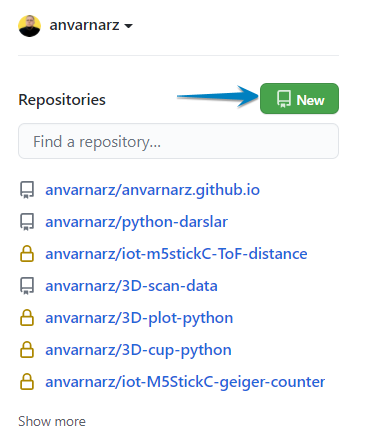
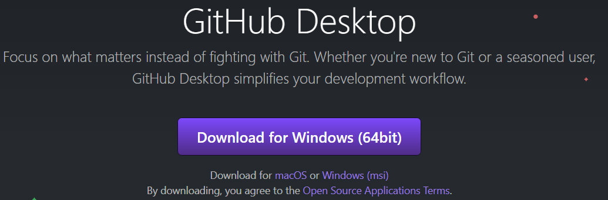
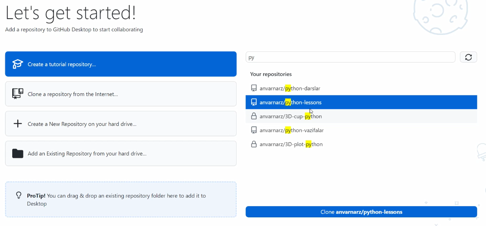
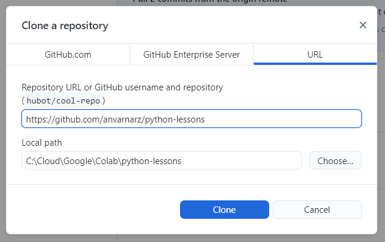

# #13 GitHub PORTFOLIO

<Embed url="https://youtu.be/sVsnh6xP_AY" />

Tajribali dasturchi, tajribasiz dasturchidan bir necha barobar qadrliroq. Dasturchi sifatida qilgan dasturlaringiz, qatnashgan loyihlaringiz haqida so'ralishingiz mumkin (masalan ish qidirish jarayonida). Tajribani ko'rsatishning eng qulay va oson usuli bu qilgan ishlaringizning onlayn portfoliosini yaratish.

:::info
Sifatli va loyihalarga boy portfolio Universitet diplomi va turli sertifikatlardan ham qadrliroq.
:::

## GITHUB NIMA?

[GitHub](https://www.github.com) - dasturlarni saqlash, ulashish va nazorat qilish uchun mo'ljallangan onlayn xosting hizmati. GitHub dasturchilarga biror loyiha ustida bir-biriga halaqit qilmagan holda jamoa bo'lib ishlash, dasturning turli versiyalarini nazorat qilib borish imkonini beradi (lekin biz bu haqida keyingi darslarimizning birida to'xtalamiz).

Bu darsda esa biz qanday qilib GitHubga loyihalarimizni yuklash, ulashish va boshqalarning loyihalarini ko'chirib olish haqida gaplashamiz.

## GITHUBDA RO'YXATDAN O'TAMIZ

Boshlanishiga [github.com](https://github.com/) sahifasiga o'tamiz va yangi akkaunt yaratamiz.

GitHubdan ro'yxatdan o'tish jarayoni juda oddiy, muhimi, email manzilingizga yuborilgan xatni tasdiqlashni unutmang.

Ro'yxatdan o'tganingizdan so'ng, o'zngiz haqingizda qisqacha ma'lumot kiritib qo'yishni ham unutmang.

## REPOSITORY

GitHubda har bir loyiha (dastur) alohida repositoryda saqlanadi. Repository omma uchun ochiq (Pulbic) yoki yopiq (Private) bo'lishi mumkin. Misol uchun, bizning darslarimiz uchun ham alohida [public repository ochilgan](https://github.com/anvarnarz/python-darslar). U yerga kirib siz darslarimizga oid kodlarni ko'chirib olishingiz mumkin. Repository bir nechta fayllar va papkalardan iborat bo'lishi tabiiy hol.

### LOYIHALARIMIZ UCHUN REPOSITORY YARATAMIZ

Bo'sh repository yaratish uchun, github.com sahifasida **New** tugmasini bosamiz.

Yanig ochilgan oynada:

1. Repositorga ma'nili nom beramiz. Nom berishda kichik harflar bilan yozing va bo'sh joy o'rniga chiziqcha (`-`) ishlating.
2. Repository ommaga ochiq (public)yoki yopiq (private) bo'lishini tanlaymiz. Buni keyin ham o'zgartirish mumkin.
3. README faylini qo'shish (qo'shmalikni) tanlaymiz. README faylida siz loyiha haqida batafsil ma'lumot berishingiz mumkin. Agar loyiha omma uchun bo'lsa albatta README faylini ham tanlang va loyihangiz haqida ma'lumot bering.
4. Create Repository tugmasini bosamiz.

Marhamat, repository tayyor. O'ng burchakdagi qalam tugmasini bosib, README faylini o'zgartirishimiz mumkin.

Hozircha repository bo'sh. Keling endi repositoryga fayllar qo'shamiz. Aksar dasturchilar gtihub bilan mahsus kommandalar yordamida ishlasada, biz osonroq usuldan, GitHub Desktop dasturidan foydalanamiz.

### GitHub DESKTOP DASTURI

Boshlanishiga GitHub Desktop dasturini o'rntaylik. Buning uchun [desktop.github.com](https://desktop.github.com/) sahifasiga kiramiz va Download tugmasini bosamiz.

:::danger
Linux OS ga GitHub desktop dasturini o'rnatish uchun [quyidagi sahifaga ](https://dev.to/rahedmir/is-github-desktop-available-for-gnu-linux-4a69)kiring.
:::

Yuklab olingan faylni ochamiz, va dasturni o'rnatamiz. Bu yerda qiyin joi yo'q. Dasturni birinchi ochganimizda Login qilish talab qilinadi.

Login qilgandan so'ng yangi oynada sizning Repositorylaringiz ko'rsatilgan oyna ochiladi. Shuyerdan oxirgi yaratgan repositoryni tanlang va pastdagi Clone tugmasini bosing.

Yangi ochilgan oynada Repository uchun kompyuterimizda joy tanlaymiz:

:::danger
**DIQQAT!** Papkalar (fayllar) nomida Kirill harflari bo'lmasin. Ba'zida, bu dasturni bajarishda xatolikka olib kelishi mumkin.
:::

Repository sizning kompyuteringizga yuklandi. Lekin repository hozircha bo'sh.

File Manager yordamida yuqoridagi Repository uchun yaratilgan papkaga kodlaringizni ko'chiring va GitHub desktop dasturiga qayting. Papkadagi barcha o'zgarishlar GitHub desktopda ham paydo bo'ldi. O'zgarishlarni Repositorga qo'shish uchun, *Summary* degan joyda o'zgarishlar haqida qisqacha ma'lumot bering va **Commit to main** tugmasini bosing.

Va nihoyat, Repositoryni onlyanga yuklash uchun **Push origin** tugmasini bosing:

Mana endi GitHub.com sahifasiga qaytib, Repository ichiga kirsak barcha fayllarimiz onlaynda turibdi. Istlagan faylni tanlab, ichidagi kodni ham ko'rishimiz mumkin.

## PUBLIC REPOSITORYNI KO'CHIRIB OLISH (CLONE)

Juda ko'p dasturchilar o'zlarining loyihalari bilan omma bilan ulashish uchun Repositoryni Public qilib qo'yadilar. Shunday Repositorylarni kompyuterga ko'chirib olish uchun avval reposytiry sahifasiga kiramiz, so'ngra burchakda Code tugmasini va yangi ochilgan Menuda esa Open with GitHub Desktop tugmalarini bosamiz.

Yuqoridagi ka'bi Repository uchun kompyuterimizda yangi joy tanlaymiz, va Clone tugmasini bosamiz.

Marhamat, Repository kompyuteringizga yuklandi. Endi kodni ochib, istalgancha o'zgartirishingiz mumkin.

## AMALIYOT

1. [GitHub.com](https://www.github.com) sahifasidan ro'yxatdan o'ting
2. Kompyuteringizga [GitHub Desktop ](https://desktop.github.com/)dasturini o'rnating
3. GitHubda Python darslari uchun yangi repository yarating
4. Shu vaqtgacha yozgan kodlaringizni yangi repositoryga yuklang
5. Sahifamizga qo'yib borilayotgan mashg'ulotlarning javoblarini quyidagi [repositorydan ](https://github.com/anvarnarz/python-darslar)o'zingizga Clone qilib oling:

<Embed url="https://github.com/anvarnarz/python-darslar" alt="python.sariq.dev repository" />