# OOP NIMA?

<Embed url="https://www.youtube.com/watch?v=1CascMOFoi0&t=2s" />

## KIRISH

Dasturlashni o’rganar ekanmiz, albatta object oriented programming (OOP) ya’ni obyektga yo’naltiriglan dasturlash tushunchasiga kelamiz. Ko’pchilik uchun bu bosqich biroz tushunarsiz va murakkabdek tuyuladi. Aslida unday emas. Keling bugun object oriented programming va unga tegishli tamoyillar haqida gaplashamiz.

## KLASSIK YOHUD CHIZIQLI DASTURLASH

OOPni tushunish uchun avval klassik dasturlashni ko’raylik. Gap shundaki ilk kompyuterlar va dasturlar matematik muammolarni hal qilishga qaratilgan. Bunday dasturlar foydalanuvchidan biror ma’lumotlarni qabul qilib olgan, va qati’iy ketma-ketlik ya’ni tartibga amal qilgan holda turli arifmetik amallarni bajarib, dastur so’ngida foydalanuvchi kutgan natijani qaytargan. Shuning uchun ham bunday dasturlar chiziqli yoki tartibli dasturlar deb ataladi.

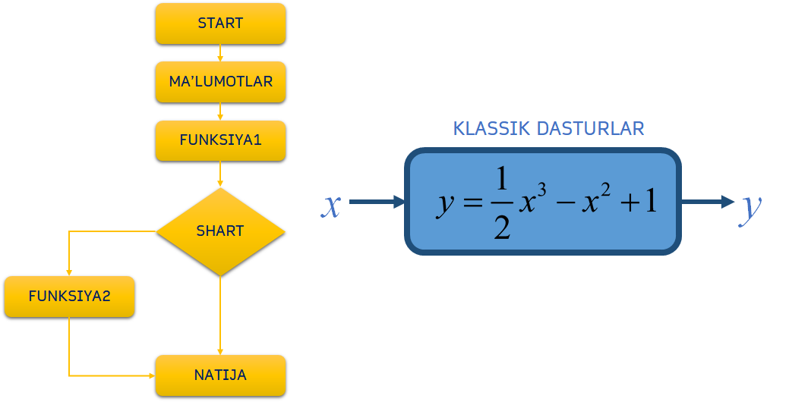

Siz ham dasturlashga ilk qadam qo’yganingizda mana shunday chiziqli dasturlarni yozishni o’rganishdan boshlaysiz.
Sizning dasturingiz bir nechta o’zgaruvchilar va funksiyalardan iborat bo’ladi.
Bu o’zgaruvchilar va funksiyalar ma’lum ketma-ketlikda bir biri bilan munosabatga kiradi va dastur yakunida siz kutgan natijani beradi.

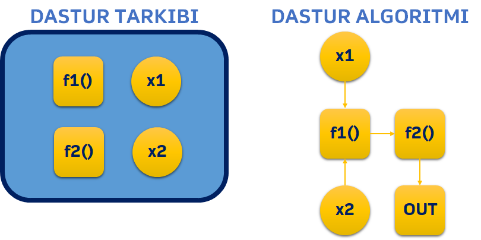

Dastur kattalashgani sari o’zgaruvchilar va funksiyalar soni ortib boradi. Ular o’rtasidagi munosabatlar ham chigallashib, kodingiz murakkab va tushunishga qiyin bo’lib ketadi.
Dasturlash jarayonida bitta funksiyaga o’zgartirish kiritishingiz esa, unga bo’gliq boshqa funksiylaraning ishdan chiqishiga va dasturingiz xato natija berishiga olib kelishi ham mumkin.

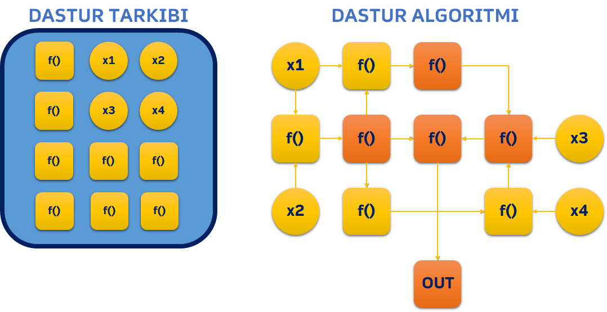

Chiziqli dasturlarning afzalliklari
:

* Dasturlashni o’rganish uchun qulay
* Sodda va tushunarli kod
* Dastur algoritmini kuzatish oson
* Dastur xotirada kamroq joy egallaydi

Chiziqli dasturlarning kamchiliklari
:

* Murakkab dasturlarni chziqili usulda yozish qiyin (ilojsiz)
* Bir dastur uchun yozilgan koddan boshqa dasturda qayta foydalanib bo’lmaydi
* Dastur ichidagi ma’lumotlar (o’zgaruvchilar) barcha funksiyalar uchun ochiq
* ZAMONAVIY DASTURLAR CHIZIQLI EMAS

Vaqt o’tib dasturlarga qo’yilgan talablar murakkablashib borgani sababli, chiziqli dasturlash tamoyili zamon talabiga javob bermay qo’ydi va 1970 yillarda object oriented programming tamoyili olg’a surila boshlandi.

## OBYEKT NIMA?

Object oriented dasturlashda o’zaro bo’gliq bo’lgan o’zgaruvchilar va funksiyalar bitta konteynerga jamlanadi va bunday konteynerlar obyekt deb ataladi.
Bir obyektga tegishli o’zgaruvchilar uning xususiyatlari, unga tegishli funksiyalar esa metodlari deb ataladi.

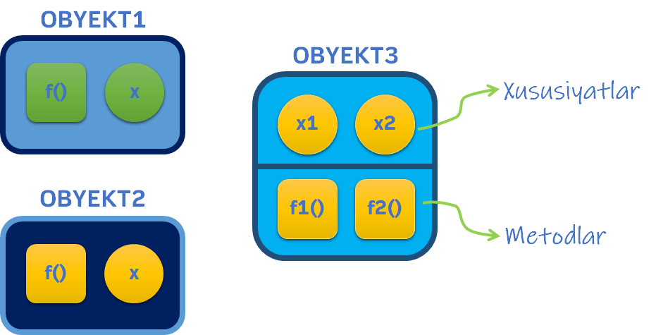

Keling misol tariqasida avtomobil degan obyektni ko’ramiz. Avtomobilning `modeli`, `rangi` va `narhi` uning xususiyatlari. Avtomobilga tegishli bo’lgan `start()`, `stop()` va `tezlashish()` kabi amallar esa uning metodlari deyiladi.

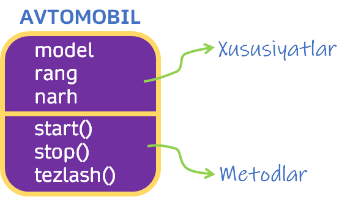

Agar real dasturdan misol keltiradigan bo’lsak, istalgan dastur ichidagi tugma bu obyekt. Uning shakli, rangi va matni esa xususiyatlari bo’ladi. Tugma ustida bajariladigan amallar tugmaning metodlari deyiladi. Misol uchun tugmani bosish, uzoq bosish, ustiga sichqonchani olib borish va hokazo.

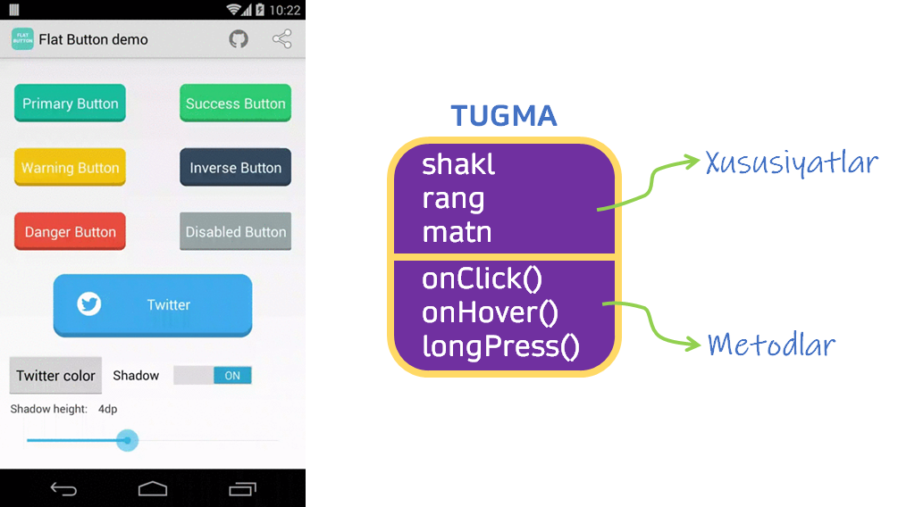

Object oriented dasturlar on’lab balki yuzlab obyektlardan iborat bo’ladi va bunday dasturlar uchun dastur boshi yoki oxiri degan tushunchalar nisbiy bo’ladi.

Object oriented dasturlar bajarilishida qat’iy ketma-ketlikka amal qilmaydi. Foydalanuvchi istlagan obyektga murojat qilishi, uning ustida turli amallar bajarishi mumkin. O’z navbatida bitta obyektga murojat ortidan boshqa obyektlar ham faollashishi mumkin.

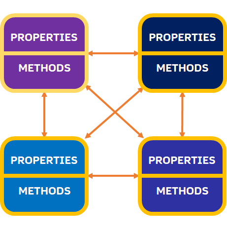

Misol uchun, mobil ilovalarda obyektlar bu dastur ichidagi tugmalar, matnlar, rasmlar va boshqa elementlardir. Foydalanuvchi istalgan tugmani bosishi, istalgan matnni ajratib olishi va boshqa amallarni istalgan tartibda bajarishi mumkin. Bunda bitta tugma (ya’ni obyektni) bosish bulan boshqa obyekt (masalan rasm) o’zgarishi mumkin.

Zamonaviy kompyuter o’yinlari ham minglab obyektlardan iborat. Foydalanuvchi esa virtual o’yin olamida erkin harakat qilishi, istlagan tarafga yurishi, istalgan vaqtda turli obyektlar bilan turli amallar bajarishi mumkin.

## KLASS NIMA?

Object oriented programming haqida gaplashar ekanmiz uning fundamental tushunchalaridan biri - **klass** haqida gapirib o’tmaslikning iloji yo’q
.
Klass bu obyekt yaratish uchun shablon yoki qolipdir. Bitta klassdan biz istalgancha nusxa olishimiz va yangi obyektlar yaratishimiz mumkin. Demak obyekt bu biror klassning xususiy ko’rinishi.
Odatda klasslarning nomi o’zgarmas, undan yaratilgan obyektlar esa istalgancha nomlanishi mumkin.

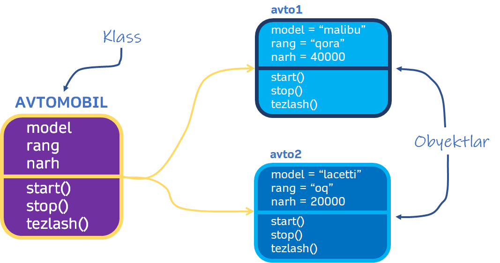

Avval aytganimizdek, dasturimiz yuzlab obyektlardan iborat bo’lishi mumkin. Klasslar esa bizga obyektlarni yaratishni yengillashtiradi.

Bu xoh dastur interfeysidagi o’nlab turli hil tugmalar bo’lsin, yoki kompyuter o’yinidagi qahramonlar bo’lsin. Har bir tugma yoki o’yin qahramoni va uning harakatlarini qayta-qayta yozmasdan bir martta yaratilgan klassdan nusxa olib, o’nlab obyektlarni yaratishimiz mumkin.

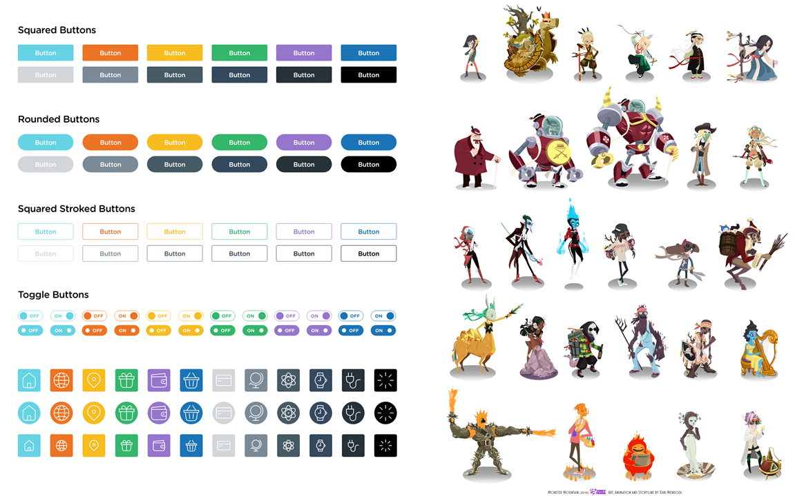

## OOP TAMOYILLARI

### INKAPSULYATSIYA

Biz object oriented dasturlash haqida gapira turib, ma’lum bir obyektga tegishli bo’lgan xususiyatlar va metodlarni bitta konteynerga joylaymiz dedik. Bu jarayon inkapsulyatsiya (ya’ni kapsulaga solish) deb ataladi. Inkapsulyatsiya bizga klasslar yaratishga va keyinchalik bu klasslardan boshqa obyektlarni yaratishga yordam beradi.

### ABSTRAKTSIYA

Abstraktsiya yordamida biz kodimizning ichki tuzilishini yashiramiz. Ya’ni, tashqaridan qaraganda obyektimiz 2 ta parameter va 2 ta metoddan iborat bo’lishi mumkin, lekin obyekt to’g’ri ishlashi uchun uning ichida o’nlab boshqa o’zgaruvchilar va funksiyalar yashirin bo’ladi.
Klassdan foydalanishda esa uning ichki tuzilishi va qanday ishlashini bilish talab qilinmaydi. Bu o’zimizga ham boshqa dasturchilarga ham bu klassdan foydalanishda qulayliklar yaratadi.

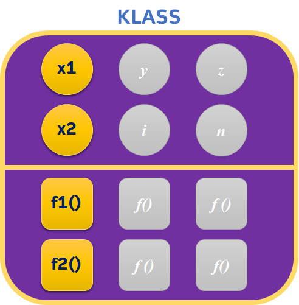

### VORISLIK

Dasturlash jarayonida biz bir klassdan boshqa klasslar yaratishimiz mumkin. Misol uchun bizda transport klassi bor, biz bu klassdan qo’shimcha Avtomobil, avtobus, kema, poyezd kabi klasslarni yaratishimiz mumkin.
Bunda bizning asl klassimiz ota yoki super klass deb ataladi, undan yaratilgan klasslar esa voris klasslar deyiladi.

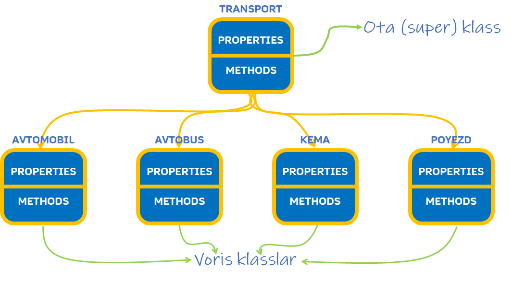

:::tip
**Voris klasslar ota klassning ba’zi yoki barcha xususiyatlari va metodlariga ega bo’ladi.**
:::

POLIMORFIZM

Voris klass super klassdan o’zlashtirilgan metodning nomini saqlagan holda, uning ishlashini o’zgartirishiga **polimorfizm** deyiladi.

Keling bir misol ko’raylik. Biz kompyuter o’yini yaratish jarayonida o’yin Qahramon uchun super klass yaratamiz.
Qahramon bir nechta xususiyatlarga va metodlarga ega. Jumladan **`attack()`** ya’ni xujum qilish metodi, qahramonni xujum qilishga undaydi.
Endi biz bu superklassdan boshqa voris klasslarni yaratamiz.

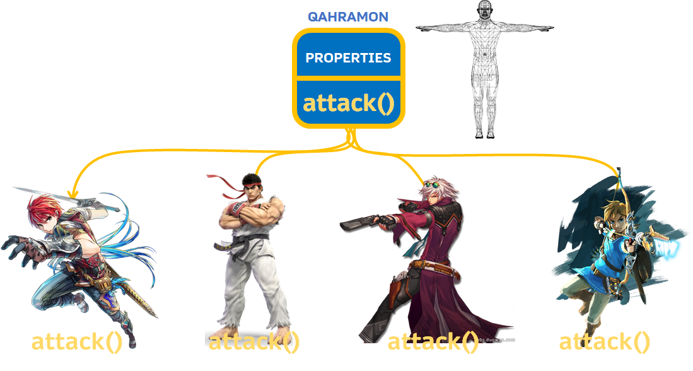

1. Birinchi qahramonimiz Qilichboz va bu qahramon xujum qilganda qilich bilan xujum qiladi.
2. Ikkinchi qahramonimiz esa Jangchi, va u qurolsiz bo’lgani sababi qo’l va oyoqlari bilan xujum qiladi.
3. Uchunchi qahramonimiz pistolet bilan,
4. Oxrigisi esa kamon va yoylar bilan qurollangan.

To’rttala qahramonimiz ham superklassdan **`attack()`** metodini meros oladi, lekin bu metodni biz har bir qahramon uchun turli ko’rinishda yozishimiz va talqin qilishimiz mumkin. Bu esa o’z navbatida bizni turli qahramonlar va turli xujum turlari uchun alohida metodlar yozishdan qutqaradi.

Mana shular OOPning asosiy tamoyillari ekan.

### OOP AFZALLIKLARI VA KAMCHILIKLARI

Keling darsimiz yakunida OOPning afzalliklari va kamchiliklariga ham to’xtalib o’tsak.

**Afzalliklari**

* Parallel dasturlash – bir loyihaning turli qismlari bir vaqtda yaratilishi mumkin
* Vorislik tamoyili klasslardan qayta foydanalish imkonini beradi
* Polimorfizm tamoyili klasslarni moslashuvchan qiladi
* Klasslardan boshqa dastur va loyihalarda qayta-qayta foydalanish mumkin

**Kamchiliklari**

* Dasturlashga yangi qadam qo’yganlar uchun biroz tushunarsiz
* Har doim ham samarali emas
* Ba’zida dasturimizni haddan tashqari murakkablashtirib yuborishi mumkin

OOP bilan qisqacha tanishuvimiz shundan iborat edi. Endi esa Python OOP bilan tanishuvni boshlasak ham bo'ladi.