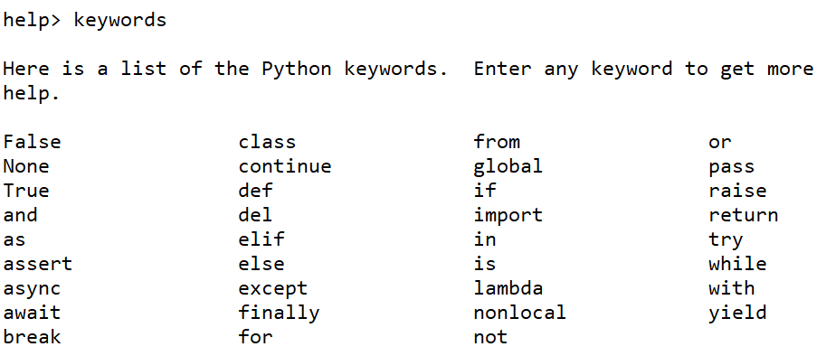

# #04 O'ZGARUVCHILAR

<Embed url="https://www.youtube.com/watch?v=4-Sj_owtx3Q" />

## O'ZGARUVCHI (VARIABLE)

**O'zgaruvchi** —kompyuter xotirasida ma'lum bir qiymatni saqlash uchun ajratilgan joy. Soddaroq qilib tushuntirsak, o'zgaruvchini quti, quti ichidagi narsani esa qiymat deb tasavvur qilish mumkin. Pythonda qiymatlar son, matn, ro'yxat va hokazo ko'rinishida bo'lishi mumkin.


Quyidagi misolga e'tibor bering, biz 2 ta o'zgaruvchi yaratdik (`ism` va `yosh`) va ularga qiymatlar yukladik (Pythonda boshqa tillardagi ka'bi o'zgaruvchilarni avvaldan e'lon qilish yo'q):

```python
ism = "Abdulloh"
yosh = 25
print(ism)
print(yosh)
```

Natija:

`Abdulloh`

`25`

O'zgaruvchi (variable) bunday deyilishiga sabab, uning qiymati istalgan vaqt o'zgartirilishi mumkin:

```python
ism = "Abdulloh"
print(ism)
ism="Muhammad"
print(ism)
```

Natija:

`Abdulloh`

`Muhammad`

Yuqoridagi misolda `ism` nomli o'zgaruvchiga avval `Abdulloh` keyin esa `Muhammad` qiymatlarini berdik.

## O'ZGARUVCHILARNI NOMLASH

:::danger
O'zgaruvchilarga nom berishda quyidagi qoidalarga amal qiling:

* O'zgaruvchi nomi harf yoki pastki chiziq (`_`) bilan boshlanishi kerak
* O'zgaruvchi nomi raqam bilan boshlanishi mumkin emas
* O'zgaruvchi nomida faqatgina lotin alifbosi harflari (`A-z`), raqamlar (`0-9`) va pastki chiziq (`_`) qatnashishi mumkin
* O'zgaruvchi nomida bo'shliq (пробел) bo'lishi mumkin emas
* O'zgaruvchi nomida katta-kichik harflar turlicha talqin qilinadi (`ism`, `ISM`, va `Ism` uchta turli o'zgaruvchi)
:::

Qo'shimcha qoida sifatida:

* O'zgaruvchi nomini kichik harflar bilan yozing.
* O'zgaruvchi nomida 2 va undan ortiq so'z qatnashsa ularning orasini pastki chiziq (\_) bilan ajrating (`ism_sharif="Anvar Narzullaev"`)
* O'zgaruvchiga tushunarli nom bering (`y=20` emas `yosh=20`, `d="Korea"` emas `davlat = "Korea"` va hokazo)
* Shuningdek o'zgaruvchilarga Pythonda ishlatiladigan funktsiyalar va maxsus kalit so'zlarning (keywords) nomini bermang. Kalit so'zlar ro'yhatini ko'rish uchun Spyder konsolida avval `help()` deb yozing va Enter tugmasini bosing. Keyin esa `keywords` deb kiritib, yana Enter bosing. Marhamat, ekraningizda Pythondagi maxsus kalit so'zlar ro'yhatini ko'ryapsiz:



## AMALIYOT

Quyidagi mashqlarni bajaring:

* `"Hello World!"` matnini yangi o'zgaruvchiga yuklang va `print()` yordamida konsolga chiqaring
* `xabar` deb nomlangan o'zgaruvchiga biror matn yuklang va konsolga chiqaring, keyin esa o'zgaruvchiga yangi qiymat berib uni ham konsolga chiqaring.
* `class` den nomlangan o'zgaruvchi yarating, unga biror qiymat bering va konsolga chiqaring (siz kutgan natija chiqdimi?)
* Quyidagi kodni bajaring:

```python
radius = 5
pi = 3.14159
aylana_yuzi = pi * radius**2
print("Radiusi" , radius, "ga teng aylananing yuzi=", aylana_yuzi)
```

## JAVOBLAR

<Embed url="https://repl.it/@anvarbek/javoblar-04-dars#main.py" />

<FileBlock src="https://1283015017-files.gitbook.io/~/files/v0/b/gitbook-legacy-files/o/assets%2F-MGbkqs1tROquIT6oqUs%2F-MLXApyXUq0jDUHl-zUt%2F-MLXBcizC30Pmh8NBXjT%2Fjavoblar-04-dars.zip?alt=media&token=93903759-bad4-45d0-bac9-3458a811e13b" size="612 B" />