# #10 IF-ELSE

<Embed url="https://www.youtube.com/watch?v=QH5Q_dyj3dI" />

## TARMOQLANISH

Shu vaqtgacha yozgan dasturlarimizga e'tibor bersangiz, dasturimiz yuqoridan pastga qarab qatorma-qator bajarilib keldi. Bu chiziqli dastur deyiladi. Voqelikda esa aksar dasturlar ma'lum bir shart bajarilishi (yoki bajarilmaganiga) ko'ra kodning bir qismidan boshqa qismiga "sakrab" o'tishi tabiiy hol. Dasturlashda bu _**tarmoqlanish**_ deb ataladi.

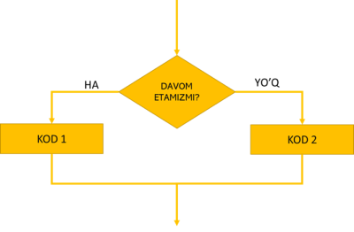

Ushbu darsimizda biz **`if`** operatori yordamida shunday shartlarni yozishni, tekshirishni va tekshiruv natijasiga ko'ra kodning turli qismlarini bajarishni o'rganamiz.

## `if` OPERATORI

**`if`** so'zi ingliz tilidan **"agar"** deb tarjima qilinadi va deyarli barcha dasturlash tillarida shartlarni yozish uchun foydalaniladi.

Keling quyidagi misolni ko'ramiz. Bizda `avtolar` ro'yxati bor:

```python
avtolar = ['audi','bmw','volvo','kia','hyundai']
```

Biz ro'yxatdagi har bil elementni katta harf bilan konsolga chiqarmoqchimiz. Bunda istisno sifatida "BMW" mashinasi nomini hamma harflarini katta bilan chiqarishimiz kerak.

Demak quyidagi kodni yozamiz:

```python
for avto in avtolar: # avtolar ichidadi har bir avto uchun ...
    if avto == 'bmw':  # ... agar avto bmw ga teng bo'lsa ...
        print(avto.upper()) # avto nomini hamma harflarini katta bilan yoz.
    else: # aks holda ... 
        print(avto.title()) # avto nomini faqat birinchi harfini katta bilann yoz.
```

Kodni tahlil qilaylik:

- 1-qatorda biz for tsiklini boshladik: _avto ichidagi har bir avto uchun._
- 2-qatorda shart yozdik: _agar avto bmw ga teng bo'lsa_ (bu yerda `==` belgisi tenglikni tekshirish belgisi hisoblanadi va **"`avto`** **`bmw` ga tengmi?"** deb o'qiladi).
- 3-qator yuqoridagi shartning badani hisoblanadi va **faqatgina** shart bajarilgandagina ishga tushadi va avto nomini hamma harflarini katta bilan yozadi (`.upper()` metodi).
- 4-qatorda yana bir yangi operator, **`else`** bilan tanishamiz. "**Else**" ingliz tilidan "**aks holda**" deb tarjima qilinadi va **`if`** sharti bajarilmaganda **`else`** qismi ichidagi kod bajariladi.
- 5-qator esa `else` (aks holda, ya'ni 2- qatordagi shart bajarilmaganda) ishga tushadi va avto nomining faqat birinchi harfini katta bilan yozadi (`.title()` metodi)

:::danger
**Diqqat!** Shart "badani" shartdan biroz o'ngga surib yoziladi (huddi `for` tsikli kabi). `if/else` dan keyin kelgan va o'ngga surib yozilgan har bir qator `if/else` shartining badani hisoblanadi.
:::

Yuoqridagi kodni bajaramiz, va natijani ko'ramiz:

```python
avtolar = ['audi','bmw','volvo','kia','hyundai']
for avto in avtolar: # avtolar ichidadi har bir avto uchun ...
    if avto == 'bmw':  # ... agar avto bmw ga teng bo'lsa ...
        print(avto.upper()) # avto nomini hamma harflarini katta bilan yoz.
    else: # aks holda ... 
        print(avto.title()) # avto nomini faqat birinchi harfini katta bilan yoz.
```

Natija:

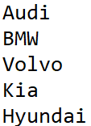

## TRUE/FALSE

Yuqorida shartni tekshirish uchun `==` operatoridan foydalandik. Bu operatorni oddiy tilga tarjima qilsak _**"tengmi?"**_ degan ma'noni beradi.

Agar shartning ikki tarafidagi qiymatlar teng bo'lsa ifoda **TRUE** qiymatini qaytaradi ("True" so'zi ingliz tilidan "haqiqiq" yoki "to'g'ri" deb tarjima qilinadi).

Aksincha, qiymatlar tenglik qanoatlantirilmasa, ifoda **FALSE** qiymatini qaytaradi ("False" so'zini ingliz tilidan "yolg'on" deb tarjima qilsak bo'ladi).

Quyidagi misollarga e'tibor bering. Biz `ism` degan o'zgaruvchi yaratdik, va unga `'Ali'` matnini yukladik. Keling endi `==` yordamida `ism` ning qiymatini tekshirib ko'ramiz:

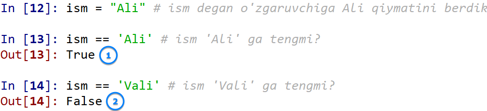

Ko'rib turganingizdek avval `ism=='Ali'` (`ism` `'Ali'` ga tengmi?) deb so'raganimizda, ifoda `TRUE` (Ha) degan javobni qaytardi, keyin esa `ism=='Vali'` (`ism` `'Vali'` ga tengmi?) deb so'raganimizda esa, ifoda `FALSE` (Yo'q) deb qiymat qaytardi.

Demak, `if/else` bog'lamasida, `if` ning badani ifoda `True` bo'lganda, `else` ning badani esa ifoda `False` bo'lganda bajariladi.

## MATNLARNI SOLISHTIRISH

Aksar tizimlar foydalanuvchi kiritgan matnni ma'lum bir ko'rinishga keltirib oladi. Buning sababi, kompyuter uchun `'Ali'`, `'ALI'`, va `'ali'` bu uchta turli hil ism. Ularni solishtirish uchun esa bir ko'rinishga keltirib olish kerak.

Tasavvur qiling siz yangi email manzil ochmoqchisiz, va o'zingizga yangi foydalanuvchi ismini tanlashingiz kerak. Kompyuter siz kiritgan foydalanuvchi ismini tizimdagi mavjud foydalanuvchilar bilan solishtiradi va agar ism band bo'lsa sizga boshqa ism tanlashni aytadi. Solishtirish jarayonida esa, siz tanlagan ismni kichik harflarga o'tkazib, boshqa ismlar bilan solishtiradi.

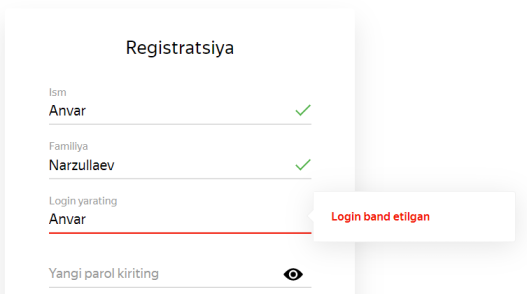

Yuqoridagi misolda, kimdur [anvar@yandex.ru](mailto\:anvar@yandex.ru) manzilini band qilgan, agarda men `'Anvar'`, yoki `'ANvar'`, yoki `'ANVAR'` deb login tanlasam ham, [anvar@yandex.ru](mailto\:anvar@yandex.ru) band bo'gani sababli men so'ragan loginlar rad qilinaveradi.

Xo'sh, turli ko'rinishda yozilgan matnlarni qanday qilib solishtiramiz? Juda oddiy. Matnlarni solishtirishdan avval `.lower()` metodi yordamida kichik harflar ko'rinishiga keltirib olamiz:

```python
ism = 'Ali'
ism.lower() == 'ali'
```

Natija: `True`

## QIYMATLARNING TENG EMASLIGINI TEKSHIRISH

Agar ikki qiymatning teng emasligini tekshirish talab qilinsa, `!=` operatoridan foydalanilamiz.

```python
ism = input('Ismingiz nima?\n>>>') # Foydalanuvchi ismini so'raymiz
if ism.lower() != 'ali': # Agar ism Aliga teng bo'lmasa ...
    print(f"Uzr, {ism.title()} biz Alini kutayapmiz.") # quyidagi xabar chiqadi
else:
    print("Salom, Ali")
```

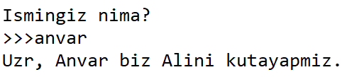

Demak yuqoridagi kodning 2-qatorida `ism` ichidagi qiymat `'ali'` ga teng bo'lmasa _"Uzr, {ism} biz Alini kutyapmiz"_ degan xabarni chiqar dedik. Aks holda (`else`), `"Salom, Ali"` degan xabar chiqadi.

:::info
Shartlarda `else` qismi bo'lishi majburiy emas. Bunga keyingi bo'limlarda tushunarliroq misollar ko'ramiz.
:::

## SONLARNI SOLISHTIRISH

Sonlarni solishtirishda yuqoridagi teng (`==`) va teng emas (`!=`) shartlariga qo'shimcha ravishda quyidagi mantiqiy shartlar ham qo'shiladi:

- Kichik: `a<b`
- Kichik yoki teng: `a&lt;=b`
- Katta: `a>b`
- Katta yoki teng: `a>=b`

```python
javob = float(input("12x6 nechiga teng?>>>"))
if javob!=72:
    print("Javob xato!")
```

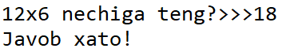

```python
yosh = int(input("Yoshingiz nechida?>>>"))
if yosh>=18: # yosh 18 dan katta yoki teng bo'lsa
    print('Xush kelibsiz!')
else: # ask holda
    print('Kirish mumkin emas!')
```

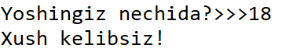

```python
login = input("Yangi login tanlang:")
if len(login)&lt;=5: # login uzunligini tekshiramiz
    print("Login 5 harfdan ko'proq bo'lishi shart!")
```

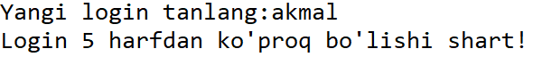

Sonlarni solishtirishda arifmetik ifodalar ham yozishimiz mumkin:

```python
yil = int(input("Tug'ilgan yilingizni kiriting:"))
if 2020-yil&lt;18: # foydalanuvchining yoshini hisoblaymiz
    print(f"Yoshingiz {2020-yil}da ekan.")
    print("Kirish mumkin emas!")
else:
    print("Xush kelibsiz!")
```

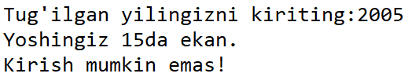

## BIR QATOR `if/else`

Qisqa kodlar uchun shart va uning badanini 1 qatorga jamlab yozishimiz ham mumkin:

```python
yosh = int(input("Yoshingiz nechida?>>>"))
if yosh>65: print("Siz COVID-19 risk guruhida ekansiz")
```

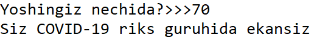

Yoki:

```python
x, y = 25, 50 # x=25 va y=50
print("x>y") if x>y else print("x<y")
```

Natija: `x<y`

## AMALIYOT

- Yangi `cars = ['toyota', 'mazda', 'hyundai', 'gm', 'kia']` degan ro'yxat tuzing, ro'yxat elementlarining birinchi harfini katta qilib konsolga chqaring. GM uchun ikkala harfni katta qiling.

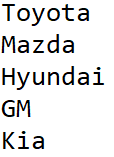

- Yuqoridagi mashqni teng emas (`!=`) operatori yordamida bajaring.
- Foydalanuvchi login ismini so'rang. Agar login admin bo'lsa, _"Xush kelibsiz, Admin. Foydalanuvchilar ro'yxatini ko'rasizmi?"_ xabarini konsolga chiqaring. Aks holda, _"Xush kelibsiz, `{foydalanuvchi_ismi}!`"_  matnini konsolga chiqaring.
- Foydalanuvchidan 2 ta son kiritishni so'rang. Agar ikki son bir-biriga teng bo'lsa, "Sonlar teng" ekan degan yozuvni konsolga chiqaring.
- Foydalanuvchidan istalgan son kiritishni so'rang. Agar son manfiy bo'lsa konsolga "Manfiy son", agar musbat bo'lsa "Musbat son" degan xabarni chiqaring.
- Foydalanuvchidan son kiritishni so'rang, agar son musbat bo'lsa uning ildizini hisoblab konsolga chiqaring. Agar son manfiy bo'lsa, "Musbat son kiriting" degan xabarni chiqaring.

## JAVOBLAR

<Embed url="https://repl.it/@anvarbek/javoblar-10-dars#main.py" />
