# #11 BIR NECHTA SHARTLARNI TEKSHIRISH

<Embed url="https://youtu.be/PQTJT44_5L8" />

## `if-elif-else` KETMA-KETLIGI

Dastur davomida bir nechta shartni tekshirish talab qilinishi mumkin. Bunday holatda biz **`if-elif-else`** ketma-ketligidan foydalanamiz. `elif` - _else_ va if so'zalrining jamlanmasi bo'lib, _"aks holda, agar"_ deb tarjima qilinadi. Bunday `if` bilan boshlangan ketma-ketlik bir nechta `elif` lardan iborat bo'lishi mumkin.

Python avval `if` shartini tekshiradi, shart bajarilmasa `elif` ga o'tadi, birinchi `elif` sharti bajarilmasa keyingi `elif` ga o'tadi va hokazo davom etaveradi.

:::danger
**Diqqat!`if-elif-else`** ketma-ketlikda biror shart bajarilishi bilan, Python qolgan shartlarni tekshirmaydi.
:::

Keling bir misol ko'ramiz. Hayvonot bo'giga kirish quyidagicha belgilangan:

- 4 yoshdan kichik bolalarga kirish bepul
- 4 yoshdan 12 yoshgacha kirish 5000 so'm
- 12 yoshdan kattalarga 10000 so'm

Foydalanuvchidan yoshini so'rab, hayvonot bog'iga kirish chiptasi narhini chiqaruvchi dastur yozamiz.

```python
yosh = int(input('Yoshingiz nechida? '))
if yosh&lt;=4:
    print('Sizga kirish bepul.')
elif yosh&lt;=12:
    print('Sizga kirish 5000 so\'m')
else:
    print('Sizga kirish 10000 so\'m')
```

Yuqoridagi kod avval foydalanuvchi yoshini so'raydi. 2-qatorda yosh 4 dan kichik ekanligini tekshiradi. Agar bu shart bajarilsa shartlarni tekshirish shu yerdayoq to'xtaydi va keyingi shartlar tashlab o'tib ketiladi.

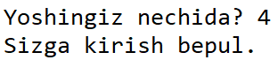

Agar `yosh&lt;=4` sharti bajarilmasa, keyingi `elif yosh&lt;=12` sharti tekshiriladi, agar shart bajarilsa quyidagi natija chiqadi:

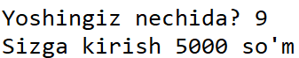

Agar yuoqridagi ikki shart ham bajarilmasa navbat o'z-o'zidan `else` bilan kelgan kod bajariladi:

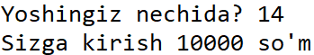

:::info
Kod yozishda yaxshi amaliyotlardan biri, kodlarni qisqa yozish va buyruqlarni qayta-qayta takrorlamaslik. Bu kelajakda kodni o'zgartirishda ham juda qo'l keladi.
:::

```python
yosh = int(input('Yoshingiz nechida? '))
if yosh&lt;=4:
    price = 0
elif yosh&lt;=12:
    price = 5000
else:
    price = 10000
    
print(f"Sizga kirish {price} so'm")
```

Avval aytganimizdek,  `if-elif-else` zanjirida bit nechta `elif` lar bo'lishi mumkin. Misol uchun, hayvonot bog'i qariyalar uchun chegirma e'lon qilsa, kodimizni quyidagicha o'zgartirishimiz mumkin:

```python
yosh = int(input('Yoshingiz nechida? '))
if yosh&lt;=4: # yosh bolalarga bepul
    price = 0
elif yosh&lt;=12: # 4 dan 12 yoshgacha 5000 so'm
    price = 5000
elif yosh&lt;65: # 12 dan katta va 65 dan kichiklarga narh 10000 so'm
    price = 10000
else: # qariyalarga esa 8000 so'm
    price = 8000
print(f"Sizga kirish {price} so'm")
```

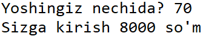

`if-elif-else` zanjirida ham `else` qismi majburiy emas:

```python
yosh = int(input('Yoshingiz nechida? '))
if yosh&lt;=4:
    price = 0
elif yosh&lt;=12:
    price = 5000
elif yosh&lt;65:
    price = 10000
elif yosh>=65:
    price = 8000    
print(f"Sizga kirish {price} so'm")
```

## `AND`, `OR` OPERATORLARI

Yuqorida aytganimizdek, `if-elif-else` zanjirida shartlarning biri bajarilishi bilan, Python qolgan shartlarni tekshirmaydi va ularni bajarmaydi. Lekin ba'zida biz 2 yoki undan ko'p shartlarni tekshirishni talab qilishimiz mumkin, buing uchun AND va OR operatorlaridan foydalanamiz.

### `OR` OPERATORI

OR ingliz tilidan "yoki" deb tarjima qilinadi, va ikki va undan ko'p shartlardan **biri** bajarilishini tekshirishda ishlatiladi. Quyidagi misolni ko'raylik, foydalanuvchidan hafta kunini so'raymiz va agar kun shanba yoki yakshanba bo'lsa, bugun dam olish kuni degan xabarni chiqaramiz, aks holda bugun ish kuni degan xabarni chiqaramiz:

```python
kun = input("Bugun nima kun?>>>")
if kun.lower()=='shanba' or kun.lower()=='yakshanba':
    print('Bugun dam olish kuni.')
else:
    print('Bugun ish kuni.')
```

2-qatrodagi **`or`** operatoriga e'tibor qiling, bu operator `kun.lower()=='shanba'` yoki `kun.lower()=='yakshanba'` shartlaridan **biri** bajarilsa TRUE qiymatini qaytaradi

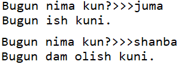

### `AND` OPERATORI

AND ingliz tilidan "va" deb tarjima qilinadi, va ikki va undan ko'p shartlarning **barchasi** bajarilishini tekshirishda ishlatiladi. `AND` operatori bilan yozilgan shartlarning **barchasi** bajarilgandagina `TRUE` qiymati qaytadi, agar shartlardan biri bajarilmay qolsa ham `FALSE` qiymati qaytadi.

Quyidagi misolni ko'ramiz:

```python
kun = input("Bugun nima kun?")
harorat = float(input("Havo harorati qanday?"))
if kun.lower()=='yakshanba' and harorat>=30:
    print("Cho'milgani ketdik!")
elif kun.lower()=='yakshanba' and harorat&lt;30:
    print("Uyda dam olamiz!")
```

3-qatordagi `and` operatori `kun.lower()=='yakshanba'` va `harorat>=30` shartlarining **ikkisi ham** bajarilgandagina `TRUE` qiymatini qaytaradi, aks holda qiymat `FALSE` bo'ladi.

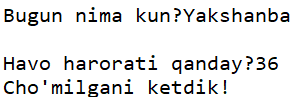

### BIR NECHTA SHARTLARNI KETMA-KET YOZISH

Shartlarni yozishda bir nechta and or operatorlarini aralashtirib ham yozish mumkin.

```python
kun = input("Bugun nima kun?")
harorat = float(input("Havo harorati qanday?"))
if (kun.lower()=='shanba' or kun.lower()=='yakshanba') and harorat>=30:
    print("Cho'milgani ketdik!")
elif (kun.lower()=='shanba' or kun.lower()=='yakshanba') and harorat&lt;30:
    print("Uyda dam olamiz!")
```

3-qatorga e'tibor bersangiz biz avval kun shanba yoki yakshanba ekanligini so'ngra haroratni tekshirdik. Bu shart bajarilishi uchun kun shanba **yoki** yakshanba **va** harorat 30 dan baland bo'lishi shart.

## BOOLEAN MA'LUMOTLAR TURI

Avvalgi darsimizda biz turli ifodalarni solishtirishda TRUE yoki FALSE qiymatlari qaytishini ko'rdik. Bu qiymatlar boolean (mantiqiy) qiymatlar deb ataladi, va dasturlashda juda keng qo'llaniladi. Pythonda o'zgaruvchilarda boolean qiymatlarni ham saqlash mumkin.

Quyidagi dasturga e'tibor bering. Deylik, restoranimizga kelgan mijoz 15000 so'mlik taom oldi, biz mijoz qo'shimcha choy va salat ham olgan (olmaganiga) qarab ularning narhini ham  yakuniy narhga qo'shishimiz kerak. Mijozning choy yoki salat olgan (olmaganini) biz `TRUE` va `FALSE` qiymatlari bilan belgiladik.

```python
narh = 15000 # mijoz 15000 so'mga taom oldi.
choy = True # mijoz choy ham oldi
salat = False # mijoz salat olmadi

if choy and salat: # agar mijoz choy ham salat ham olgan bo'lsa
    narh = narh + 10000 # narhga 10000 so'm qo'shamiz
elif choy or salat: # agar choy yoki salat olgan bo'lsa
    narh = narh + 5000 # narhga 5000 so'm qo'shamiz

print(f"Jami {narh} so'm") # yakuniy narhni chiqaramiz
```

Natija: `Jami 20000 so'm`

E'tibor bering, `choy` va `salat` boolean (mantiqiy) qiymatlar bo'gani uchun, 5 va 7-qatorlarda biz `choy==True` yoki `salat==True` deb yozib o'tirishimiz shart emas.

Yuoqirdagi misolda `choy = True` (choy oldi) va `salat = False` (salat olmadi) bo'lgani uchun yakuniy narh `narh+5000=20000` chiqdi.

:::info
Boolean o'zgaruvchilarni saqlashda `TRUE` va `FALSE` qiymatlari o'rniga `1` va `0` sonlarini ham ishlatish mumkin.
:::

## SHARTLARNI KETMA-KET TEKSHIRISH

`if-elif-else` zanjirining kamchiligidan biri, shartlardan biri bajarilishi bilan, qolgan shartlar tekshirilmaydi. Shung uchun ba'zida shartlarni ketma ket tekshirish uchun, har bir shartni alohida if bilan ajratish talab qilinishi mumkin.

Yuqoridagi misolni kengaytiraylik:

```python
narh = 15000 # mijoz 15 so'mga ovqat oldi
choy = True
salat = False
non = True
kompot = True
assorti = False
#Quyidagi har bir shart alohida tekshiriladi va bir-biriga bog'liq emas
if choy:   # agar choy olsa
    print("Mijoz choy oldi.")
    narh = narh + 3000
if salat:  # agar salat olsa
    print("Mijoz salat oldi.")
    narh = narh + 5000
if non:    # agar non olsa
    print("Mijoz non oldi.")
    narh = narh + 2000
if kompot: # agar kompot olsa
    print("Mijoz kompot oldi.")
    narh = narh + 5000
if assorti: # agar assorti olsa
    print("Mijoz assorti oldi.")
    narh = narh + 15000
    
print(f"Jami {narh} so'm")
```

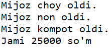

Yuqoridagi dasturda har bir `if` alohida tekshiriladi va avvalgi yoki keyingi `if` ga bog'liq emas.

## RO'YXAT TARKIBINI TEKSHIRISH

### `in` OPERATORI

**`in`** operatori yordamida biz ro'yxatning tarkibida ma'lum bir element borligini tekshirishimiz mumkin.

```python
menu = ['osh','qazonkabob','shashlik','norin','somsa']
'manti' in menu # menu da manti bormi?
```

Natija: `False`

```python
menu = ['osh','qazonkabob','shashlik','norin','somsa']
'osh' in menu # menu da osh bormi?
```

Natija: `True`

```python
menu = ['osh','qazonkabob','shashlik','norin','somsa']
ovqat = input('Nima ovqat yeysiz?>>>')
if ovqat.lower() in menu:
    print('Buyurtma qabul qilindi.')
else:
    print('Afsuski bizda bunday ovqat yo\'q')
```

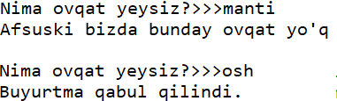

### `not in` OPERATORI

**`not in`** operatori yordamida esa biror element ro'yxatda yo'qligini tekshirishimiz mumkin.

```python
menu = ['osh','qazonkabob','shashlik','norin','somsa']
'manti' not in menu # menu da manti yo'qmi?
```

Natija: `True`

```python
menu = ['osh','qazonkabob','shashlik','norin','somsa']
'osh' not in menu # menu da osh yo'qmi?
```

Natija: `False`

```python
menu = ['osh','qazonkabob','shashlik','norin','somsa']
ovqat = input('Nima ovqat yeysiz?>>>')
if ovqat.lower() not in menu:
    print('Afsuski bizda bunday ovqat yo\'q')
else:
    print('Buyurtma qabul qilindi.')
```

:::info
`not` operatorini boshqa shartlarning oldidan ham qo'yishimiz mumkin. Misol uchun: `if not a==5` ifodasi `if a!=5` ifodasi bilan bir hil natija qaytaradi.
:::

### IKKI RO'YXATNI SOLISHTIRISH

Ikki ro'yxatning tarkibi quyidagicha tekshiriladi:

```python
menu = ['osh','qazonkabob','shashlik','norin','somsa']
buyurtmalar = ["osh","somsa","manti", "shashlik"]

for taom in buyurtmalar:
    if taom in menu:
        print(f"Menuda {taom} bor")
    else:
        print(f"Kechirasiz, menuda {taom} yo'q")
```

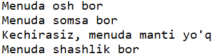

### RO'YXAT BO'SH EMASLIGINI TEKSHIRISH

Yuqoridagi dasturimizda biz foydalanuvchi buyurtma berdi deb tasavvur qilyapmiz. Lekin foydalanuvchidan bo'sh ro'yxat kelsachi? Demak for tsiklini bajarishdan avval ro'yxat bo'sh emasligiga amin bo'lishimiz kerak. Buning uchun avvalgi kodimizni quyidagicha o'zgartiramiz:

```python
menu = ['osh','qazonkabob','shashlik','norin','somsa']
buyurtmalar = ["osh","somsa","manti", "shashlik"]

if buyurtmalar: # ro'yxatda biror element bo'lsa bu ifoda TRUE qaytaradi
    for taom in buyurtmalar:
        if taom in menu:
            print(f"Menuda {taom} bor")
        else:
            print(f"Kechirasiz, menuda {taom} yo'q")
else: # agar ro'yxat bo'sh bo'lsa
    print("Savatchangiz bo'sh!")
```

Demak `if royxat_nomi:` ifodasi agar ro'yxatda bir dona element bo'lsa ham `TRUE` qiymat qaytaradi, aks holda `FALSE` qiymatini qaytaradi.

## AMALIYOT

Quyidagi dasturlarni alohida fayllarga yozing va bajaring:

- Foydalanuvchidan juft son kiritishni so'rang. Agar foydalanuvchi juft son kiritsa "Rahmat!", agar toq son kiritsa "Bu son juft emas" degan xabarni chiqaring.

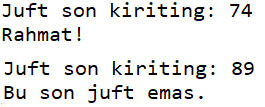

- Foydalanuvchi yoshini so'rang, va muzeyga kirish uchun chipta narhini quyidagicha chiqaring:
  - Agar foydalanuvchi 4 yoshdan kichkina yoki 60 dan katta bo'lsa bepul
  - Agar foydalanuvchi 18 dan kichik bo'lsa 10000 so'm
  - Agar foydalanuvchi 18 dan katta bo'lsa 20000 so'm
- Foydalanuvchidan ikita son kiritishni so'rang, sonlarni solishtiring va ularning teng yoki katta/kichikligi haqida xabarni chiqaring

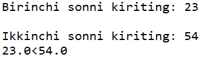

- `mahsulotlar` degan ro'yxat yarating va kamida 10 ta turli mahsulotni kiriting. Yangi, `savat` degan bo'sh ro'yxat yarating va foydalanuvchidan savatga kamida 5 ta mahsulot kiritishni so'rang. Savatdagi elementlarni, `mahsulotlar` ro'yxati bilan solishtiring va qaysi biri ro'yxatda bo'lsa "_Mahsulot_ do'konimizda bor" aks holda, "_Mahsulot_ do'konimizda yo'q" degan xabarlarni chiqaring.

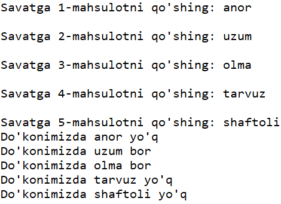

- Yuqoridagi dasturni quyidagicha o'zgartiring: foydalanuvchidan 5 ta mahsulot kiritishni so'rang. Foydalanuvchi so'ragan va do'konda bor mahsulotlarni yang, `bor_mahsulotlar` degan ro'yxatga, do'konda yo'q mahsulotlarni esa `mavjud_emas` degan ro'yxatga qo'shing.  Agar mavjud\_emas ro'yxati bo'sh bo'lsa, "Siz so'ragan barcha mahsulotlar do'konimizda bor" degan xabarni, aks holda esa "Quyidagi mahsulotlar do'konimizda yo'q: ....." degan xabarni chiqaring.

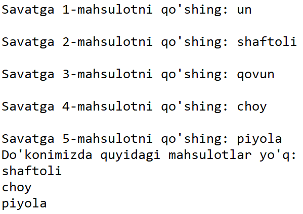

- `foydalanuvchilar` degan ro'yxat tuzing, va kamida 5 ta login qo'shing. Foydalanuvchidan yangi login tanlashni so'rang va foydalanuvchi kiritgan loginni foydalanuvchilar degan ro'yxatning tarkibi bilan solishtiring. Agar ro'yxatda bunday login mavjud bo'lsa, "Login band, yangi login tanlang!" aks holda "Xush kelibsiz, _foydalanuvchi_!" xabarini chiqaring.

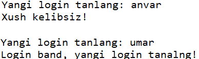

- Foydalanuvchidan biror butun son kiritishni so'rang. Foydalanuvchi kiritgan sonni 2 da 10 gacha bo'lgan sonlardan qay biriga qoldiqsiz bo'linishini konsolga chiqaring.

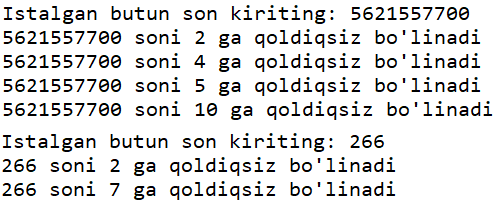

## JAVOBLAR

<FileBlock src="https://1283015017-files.gitbook.io/~/files/v0/b/gitbook-legacy-files/o/assets%2F-MGbkqs1tROquIT6oqUs%2F-MN3bNMGxI8LpxCi-Pf3%2F-MN3gkOcq5rPFTnUKMgB%2F11-dars-if-elif-else.zip?alt=media&token=fbb90b19-7c0a-4fcd-84d4-f12070f9c6b0" size="2.8 KB" />

<Embed url="https://repl.it/@anvarbek/javoblar-11-dars-01" />

<Embed url="https://repl.it/@anvarbek/javoblar-11-dars-02" />

<Embed url="https://repl.it/@anvarbek/javoblar-11-dars-03" />

<Embed url="https://repl.it/@anvarbek/javoblar-11-dars-04" />

<Embed url="https://repl.it/@anvarbek/javoblar-11-dars-04b#main.py" />

<Embed url="https://repl.it/@anvarbek/javoblar-11-dars-05" />

<Embed url="https://repl.it/@anvarbek/javoblar-11-dars-06" />
