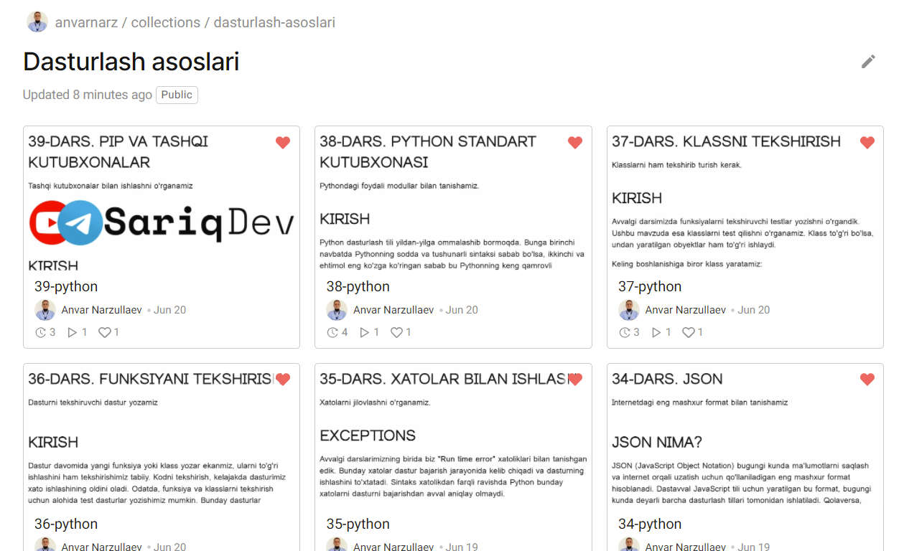
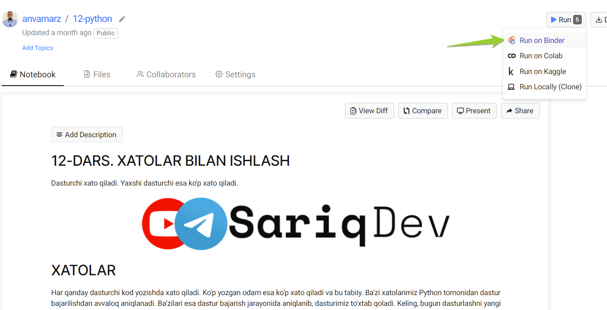
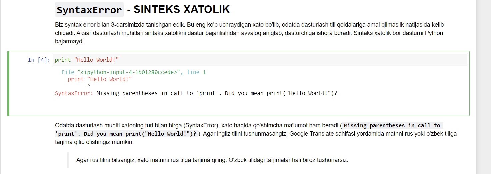
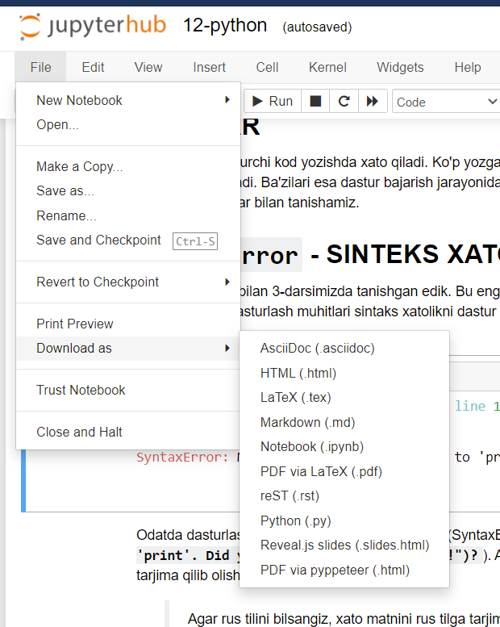

# YANGILIK!!

Saytimiz ilk bor e'lon qilinganidan so'ng ko'p o'zgartirishlar kiritildi. Shunday o'zgatirishlardan biri bu - dasrsiligmizning barcha bo'limlar maxsus Jupyter notebook standartida qayta yozildi.

Bu texnologiyaning qulayligi shundaki, istalgan darsni brauzer oynasida ochishingiz va istalgan kodga istalgancha o'zgartirish kiritib shu oynaning o'zidayoq bajarib ko'rishingiz mumkin.

Xo'sh interaktiv darslardan qanday foydalanamiz?

Avvalo quyidagi bog'lamaga kiring: [https://jovian.ai/anvarnarz/collections/dasturlash-asoslari](https://jovian.ai/anvarnarz/collections/dasturlash-asoslari)

Bu yerda barcha darslarimizni jadval ko'rinishida ko'rishingiz mumkin:

O'zignizni qiziqtirgan mavzuni bossangiz, dars yangi oynada ochiladi. Endi interaktib noutbukni ishga tushirish uchun sahifa yuqorisidagi `Run` va `Run on Binder` tugmasini bosing.

Interaktiv noutbuk yangi Binder sahifasida ochiladi. Bu yerda noutbuk ichidagi istalgan kodni Ctrl+Enter tugmalarini bosish orqali ishga tushirish mumkin. Shuningdek istalgan kod yoki matnga o'zgartirish kiritish ham mumkin.

Yana bir qulaylik, istalgan darsni PDF yoki python (py) va boshqa formatlarda kompyuterga yuklab olishinigiz mumkin. Buning uchun yuqorida File-Download as menusiga kirsangiz kifoya.

